# Architecture

## 1. Overview

The application simulates an autonomous crypto trading bot. It reads market data from Binance, generates trading signals and executes orders. Orders go either to a virtual account (Training) or to a **Binance Demo Mode** account with fake funds. Nothing is ever sent to a live trading account; the configuration refuses any trading URL that does not point to the configured demo host (`demo-api.binance.com`).

| Mode | Data source | Purpose |
|---|---|---|
| `TRAINING` (backtest) | Historical Binance data (REST) | Run the bot over a past period to analyse it |
| `TRADING` (live-sim) | Live Binance streams (WebSocket) | Run the bot on live prices |

Both modes run **the same pipeline and the same logic**. Only the source of events differs. No look-ahead: an event only ever sees the data the candle feed has delivered up to that event's execution time.

### Status

| Part | Status |
|---|---|
| Market data: brokers, candle feeder, WebSocket streams, REST history, ticker price map | **Built** |
| Demo account orders: signed market orders and balances on Binance Demo Mode, REST endpoints | **Built** |
| Candle store: ticker and candle tables, paged download (§16.1) | In progress |
| Trading algorithm with required and optional settings, SMA example (§16.2) | In progress |
| Order checks, virtual account for training (§16.3) | In progress |
| Recorded runs and settings (start, change, end), training runs (§16.4, §16.5) | In progress |
| Live bot: `TradingBotService`, `currentParameters`, editing (§16.5, §16.6) | In progress |
| Database: PostgreSQL + Flyway, raw SQL. Orders: open, executed and refused, in one table | **Built** |
| Positions at average cost with P&L, MAE and MFE (§8) | In progress |
| Database: restart reconciliation | Planned, next |
| React dashboard: tickers, holdings, orders, mode switch, light and dark theme | **Built** (§15) |
| Dashboard: live bot, training and runs tabs, settings forms, charts, following tickers (§15.1, §15.2) | In progress |
| Rest of the REST API (bot controls, runs, charts) | Planned |

### System overview

Solid boxes are built; dashed boxes are planned.

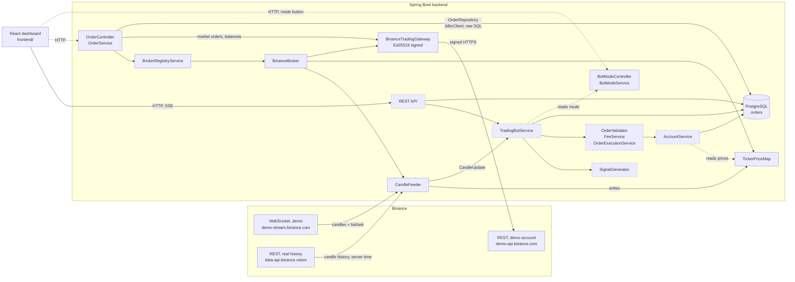
```mermaid
flowchart LR
    subgraph Binance["Binance"]
        WS["WebSocket, demo<br/>demo-stream.binance.com"]
        REST["REST, real history<br/>data-api.binance.vision"]
        DemoApi["REST, demo account<br/>demo-api.binance.com"]
    end

    subgraph Backend["Spring Boot backend"]
        OrderApi["OrderController<br/>OrderService"]
        ModeApi["BotModeController<br/>BotModeService"]
        Registry["BrokerRegistryService"]
        Broker["BinanceBroker"]
        Feeder["CandleFeeder"]
        Prices["TickerPriceMap"]
        Gateway["BinanceTradingGateway<br/>Ed25519 signed"]
        Bot["TradingBotService"]
        Signal["SignalGenerator"]
        Orders["OrderValidator<br/>FeeService<br/>OrderExecutionService"]
        Account["AccountService"]
        Db[("PostgreSQL<br/>orders")]
        Api["REST API"]
    end

    Ui["React dashboard<br/>frontend/"]

    WS -- "candles + bid/ask" --> Feeder
    REST -- "candle history, server time" --> Feeder
    Registry --> Broker
    Broker --> Feeder
    Broker --> Prices
    Broker --> Gateway
    OrderApi --> Registry
    OrderApi -- "market orders, balances" --> Gateway
    Gateway -- "signed HTTPS" --> DemoApi
    OrderApi -- "OrderRepository<br/>JdbcClient, raw SQL" --> Db
    Feeder -- writes --> Prices
    Feeder -- CandleUpdate --> Bot
    Bot --> Signal
    Bot --> Orders
    Orders --> Account
    Account -. reads prices .-> Prices
    Account --> Db
    Bot --> Db
    Api --> Bot
    Api --> Db
    Ui -- "HTTP, SSE" --> Api
    Ui -. HTTP .-> OrderApi
    Ui -. "HTTP, mode button" .-> ModeApi
    Bot -. reads mode .-> ModeApi

    classDef planned stroke-dasharray: 5 5
    class Bot,Signal,Orders,Account,Api planned
```

## 2. Components

| Component | Status | Responsibility |
|---|---|---|
| `Broker` | Built | One exchange: name, tickers, candle feeder and ticker price map. `AbstractBroker` is the abstract factory; `BinanceBroker` is the first implementation. One singleton per exchange |
| `BrokerRegistryService` | Built | Holds every broker by name, so several brokers can run at once. Rejects duplicate names |
| `CandleFeeder` | Built | One shared class for all brokers: WebSocket connections, grouping streams by connection, history paging, exchange clock offset. Writes the broker's ticker price map and hands `CandleUpdate`s to listeners. Never touches the account |
| `ExchangeMarketDataProtocol` | Built | The exchange-specific part of market data: stream names, URLs, limits, message parsing |
| `MarketDataStreamConnection` | Built | One WebSocket connection with a fixed 5-second reconnect (`JdkWebSocketConnection`) |
| `TickerPriceMap` | Built | Latest quote per ticker, per broker. Written by the candle feeder (`TickerPriceWriter`), read by everyone else (`TickerPriceReader`) |
| `ExchangeTradingGateway` | Built | The exchange-specific part of trading: place a market order, read balances. `BinanceTradingGateway` is a singleton Spring bean, injected into `BinanceBroker`. Its Binance JSON mapping lives in `broker.binance.util.OrderUtil` |
| `RequestSigner` | Built | Signs a request's query string. `BinanceRequestSigner` uses Ed25519. Without an API key, `MissingKeyRequestSigner` is used instead and refuses every signed request, so trading is off |
| `BalanceCachingTradingGateway` | Built | Wraps a broker's trading gateway and answers balance reads from its `AccountBalanceCache`, so they send no request (§7.2) |
| `BinanceUserDataStream` | Built | Binance's user data stream, on its own WebSocket connection (`userdata` package). Applies `outboundAccountPosition` balance events to the cache, and has `AccountBalanceSynchronizer` take a snapshot after each subscription and every 15 minutes (§7.2) |
| `OrderService` | Built | Finds the broker, checks the ticker is one it trades, sends the order to the broker's trading gateway, then stores the result in `orders` (§7.1, §11) |
| `OrderController` | Built | `POST /api/brokers/{broker}/orders` and `GET /api/brokers/{broker}/balance`. `ApiExceptionHandler` turns failures into HTTP problem responses |
| `BotModeService` | Built | The current `BotMode` (`TRADING` or `TRAINING`). Switched at runtime, without a restart, through `PUT /api/bot/mode` |
| `TradingBotService` | Planned | Owns the event loop, the bot state and the runs |
| `SignalGenerator` | Planned | Interface for trading logic, with several implementations chosen by config. Returns `Buy`, `Sell` or `Hold` |
| `OrderValidator` | Planned | Turns a signal into a valid `OrderRequest`, or rejects it |
| `FeeService` | Planned | Provides fee rates (exact Binance rates with an API key, the standard schedule otherwise) and calculates fees |
| `OrderExecutionService` | Planned | Fills a valid `OrderRequest` and produces an `ExecutedOrder`. No validation or fee logic |
| `PositionTracker` | In progress | Applies `ExecutedOrder`s to the bot's position at average cost, and calculates realised P&L, MAE and MFE (§8) |
| `OrderRepository` | Built | PostgreSQL access for the order tables (`JdbcClient`, raw SQL, no ORM). Implements `OrderStore`, so `OrderService` doesn't depend on the database code |
| Other repositories | Planned | Lots, trades, candles, runs |
| REST API | Planned | Controls and read endpoints for the React dashboard |

Components exchange immutable DTOs (Java records): `CandleUpdate`, `BidAskUpdate`, `Signal`, `OrderRequest`, `ExecutedOrder`, `TradeHistoryEntry`, `PortfolioSnapshot`.

## 3. Event pipeline (planned)

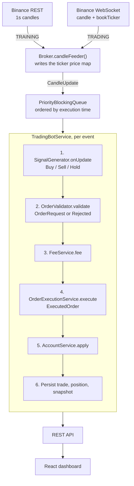
```mermaid
flowchart TD
    Rest["Binance REST<br/>1s candles"] -- TRAINING --> Feeder
    Ws["Binance WebSocket<br/>candle + bookTicker"] -- TRADING --> Feeder
    Feeder["Broker.candleFeeder()<br/>writes the ticker price map"] -- CandleUpdate --> Queue
    Queue["PriorityBlockingQueue<br/>ordered by execution time"] --> Bot

    subgraph Bot["TradingBotService, per event"]
        direction TB
        S1["1. SignalGenerator.onUpdate<br/>Buy / Sell / Hold"]
        S2["2. OrderValidator.validate<br/>OrderRequest or Rejected"]
        S3["3. FeeService.fee"]
        S4["4. OrderExecutionService.execute<br/>ExecutedOrder"]
        S5["5. AccountService.apply"]
        S6["6. Persist trade, position, snapshot"]
        S1 --> S2 --> S3 --> S4 --> S5 --> S6
    end

    Bot --> Api["REST API"] --> Ui["React dashboard"]
```

## 4. Market data (built)

### 4.1 Brokers

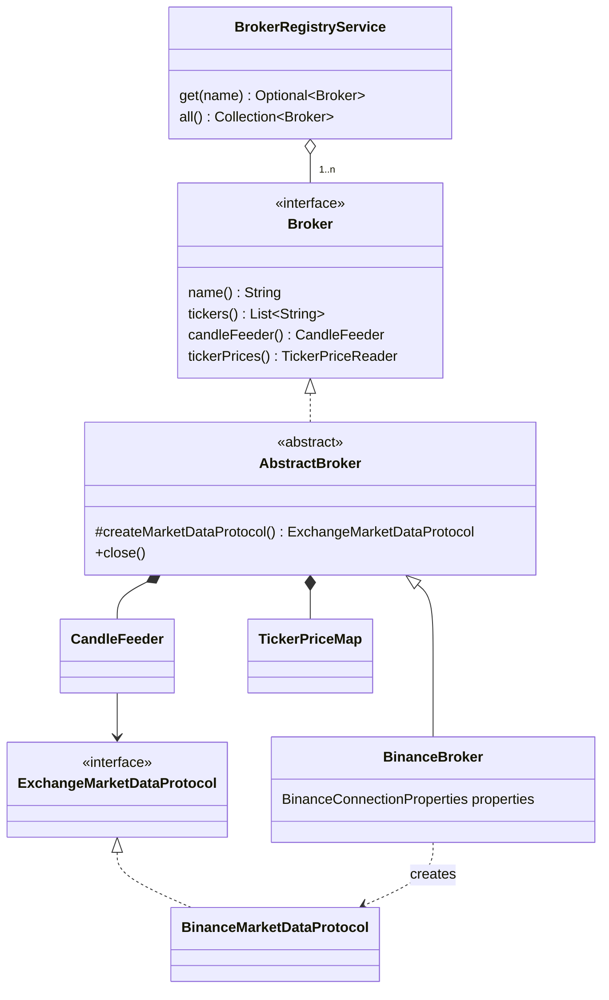
```mermaid
classDiagram
    class Broker {
        <<interface>>
        name() String
        tickers() List~String~
        candleFeeder() CandleFeeder
        tickerPrices() TickerPriceReader
    }
    class AbstractBroker {
        <<abstract>>
        #createMarketDataProtocol() ExchangeMarketDataProtocol
        +close()
    }
    class BinanceBroker {
        BinanceConnectionProperties properties
    }
    class BrokerRegistryService {
        get(name) Optional~Broker~
        all() Collection~Broker~
    }
    class CandleFeeder
    class TickerPriceMap
    class ExchangeMarketDataProtocol {
        <<interface>>
    }
    class BinanceMarketDataProtocol

    Broker <|.. AbstractBroker
    AbstractBroker <|-- BinanceBroker
    BrokerRegistryService o-- "1..n" Broker
    AbstractBroker *-- CandleFeeder
    AbstractBroker *-- TickerPriceMap
    CandleFeeder --> ExchangeMarketDataProtocol
    ExchangeMarketDataProtocol <|.. BinanceMarketDataProtocol
    BinanceBroker ..> BinanceMarketDataProtocol : creates
```

- Every broker is a Spring singleton. The registry fails at startup if two brokers share a name.
- Each broker *has* a `CandleFeeder` (composition), built on the first call to `candleFeeder()`. The feeder logic is shared; only the `ExchangeMarketDataProtocol` differs per exchange.
- `BinanceBroker` reads its settings from `binance.*` in `application.yaml` (`BinanceConnectionProperties`). Startup fails if no tickers are configured.
- Planned: a portfolio per broker, transfers between brokers (which take time), and an `OrderGateway` factory method. Orders go to the Binance Spot Testnet first, then to real Binance's validate-only `POST /api/v3/order/test`.

### 4.2 Live data flow

Three kinds of threads touch market data. The WebSocket thread does only quick work, so it can ask for the next message straight away.

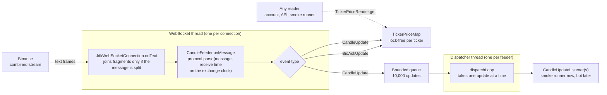
```mermaid
flowchart LR
    Binance["Binance<br/>combined stream"] -- "text frames" --> Conn

    subgraph SocketThread["WebSocket thread (one per connection)"]
        Conn["JdkWebSocketConnection.onText<br/>joins fragments only if the<br/>message is split"]
        Parse["CandleFeeder.onMessage<br/>protocol.parse(message, receive time<br/>on the exchange clock)"]
        Apply{"event type"}
        Conn --> Parse --> Apply
    end

    Apply -- BidAskUpdate --> Map
    Apply -- CandleUpdate --> Map
    Apply -- CandleUpdate --> Queue["Bounded queue<br/>10,000 updates"]
    Map["TickerPriceMap<br/>lock-free per ticker"]

    subgraph DispatchThread["Dispatcher thread (one per feeder)"]
        Dispatch["dispatchLoop<br/>takes one update at a time"]
    end

    Queue --> Dispatch --> Listeners["CandleUpdateListener(s)<br/>smoke runner now, bot later"]
    Readers["Any reader<br/>account, API, smoke runner"] -. "TickerPriceReader.get" .-> Map
```

1. A text frame arrives. A message that arrives in one piece is handed on directly; a split message is collected and the buffer is released afterwards.
2. `ExchangeMarketDataProtocol.parse` turns it into a `CandleUpdate`, a `BidAskUpdate`, or nothing (for example a subscription acknowledgement).
3. **`BidAskUpdate`:** updates bid and ask in the price map.
4. **`CandleUpdate`:** updates the last price in the price map and is offered to the queue. If the queue is full the update is dropped with a warning; the socket is never blocked.
5. The connection then asks for the next message (`request(1)` in a `finally`, so a failure never stalls the stream).
6. The dispatcher thread hands each `CandleUpdate` to every listener. A failing listener is logged and the others still run.

### 4.3 Starting a feeder

`start()` is all or nothing: either every connection opens, or everything is closed again and the error is passed on.

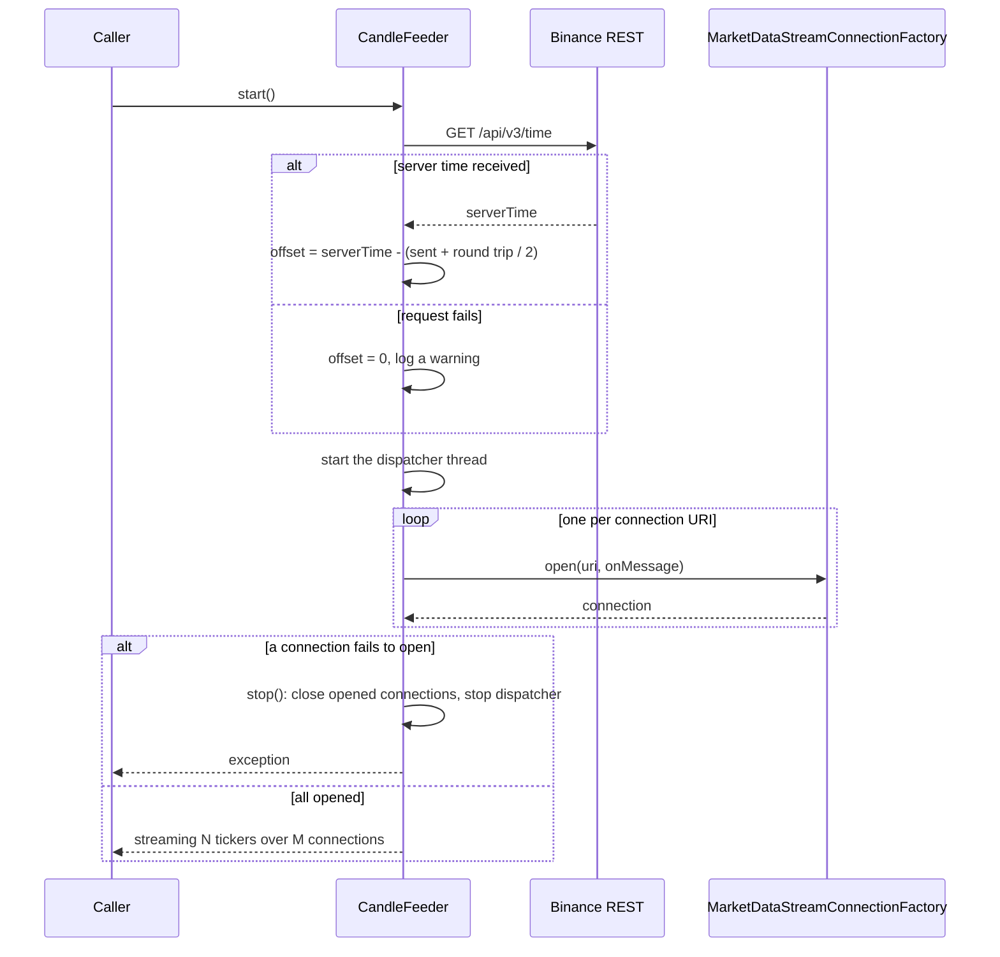
```mermaid
sequenceDiagram
    participant Caller
    participant Feeder as CandleFeeder
    participant Rest as Binance REST
    participant Factory as MarketDataStreamConnectionFactory

    Caller->>Feeder: start()
    Feeder->>Rest: GET /api/v3/time
    alt server time received
        Rest-->>Feeder: serverTime
        Feeder->>Feeder: offset = serverTime - (sent + round trip / 2)
    else request fails
        Feeder->>Feeder: offset = 0, log a warning
    end
    Feeder->>Feeder: start the dispatcher thread
    loop one per connection URI
        Feeder->>Factory: open(uri, onMessage)
        Factory-->>Feeder: connection
    end
    alt a connection fails to open
        Feeder->>Feeder: stop(): close opened connections, stop dispatcher
        Feeder-->>Caller: exception
    else all opened
        Feeder-->>Caller: streaming N tickers over M connections
    end
```

### 4.4 Grouping streams into connections

One connection carries up to 1,024 streams (Binance's limit). Every ticker has 2 streams (candle and bid/ask), and a ticker's streams never get split across connections.

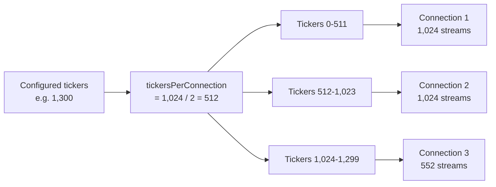
```mermaid
flowchart LR
    Tickers["Configured tickers<br/>e.g. 1,300"] --> Size["tickersPerConnection<br/>= 1,024 / 2 = 512"]
    Size --> G1["Tickers 0-511"] --> U1["Connection 1<br/>1,024 streams"]
    Size --> G2["Tickers 512-1,023"] --> U2["Connection 2<br/>1,024 streams"]
    Size --> G3["Tickers 1,024-1,299"] --> U3["Connection 3<br/>552 streams"]
```

Each connection URI is a combined stream, for example:

```
wss://demo-stream.binance.com/stream?streams=btcusdt@kline_1m/btcusdt@bookTicker/ethusdt@kline_1m/ethusdt@bookTicker
```

With the two default tickers this is a single connection.

### 4.5 Connection lifecycle

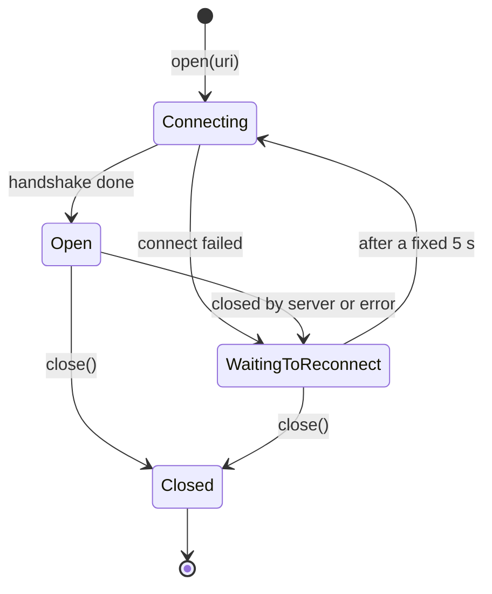
```mermaid
stateDiagram-v2
    [*] --> Connecting: open(uri)
    Connecting --> Open: handshake done
    Connecting --> WaitingToReconnect: connect failed
    Open --> WaitingToReconnect: closed by server or error
    WaitingToReconnect --> Connecting: after a fixed 5 s
    Open --> Closed: close()
    WaitingToReconnect --> Closed: close()
    Closed --> [*]
```

- Pings are answered with pongs. Binance drops every connection after 24 hours; it reconnects like any other drop.
- The fixed 5-second delay stays well under Binance's limit of 300 connection attempts per 5 minutes per IP.
- If the reconnect scheduler is shutting down, no reconnect is scheduled and that is logged.

### 4.6 Candle history over REST

`history(ticker, interval, from, to)` pages `GET /api/v3/klines` (Binance calls candles "klines"), up to 1,000 candles per request.

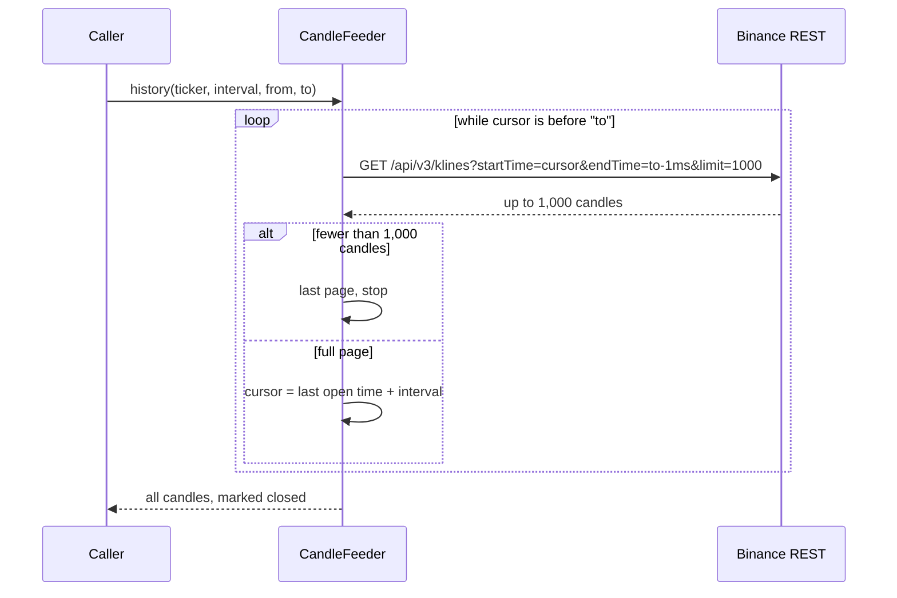
```mermaid
sequenceDiagram
    participant Caller
    participant Feeder as CandleFeeder
    participant Rest as Binance REST

    Caller->>Feeder: history(ticker, interval, from, to)
    loop while cursor is before "to"
        Feeder->>Rest: GET /api/v3/klines?startTime=cursor&endTime=to-1ms&limit=1000
        Rest-->>Feeder: up to 1,000 candles
        alt fewer than 1,000 candles
            Feeder->>Feeder: last page, stop
        else full page
            Feeder->>Feeder: cursor = last open time + interval
        end
    end
    Feeder-->>Caller: all candles, marked closed
```

### 4.7 Market data events

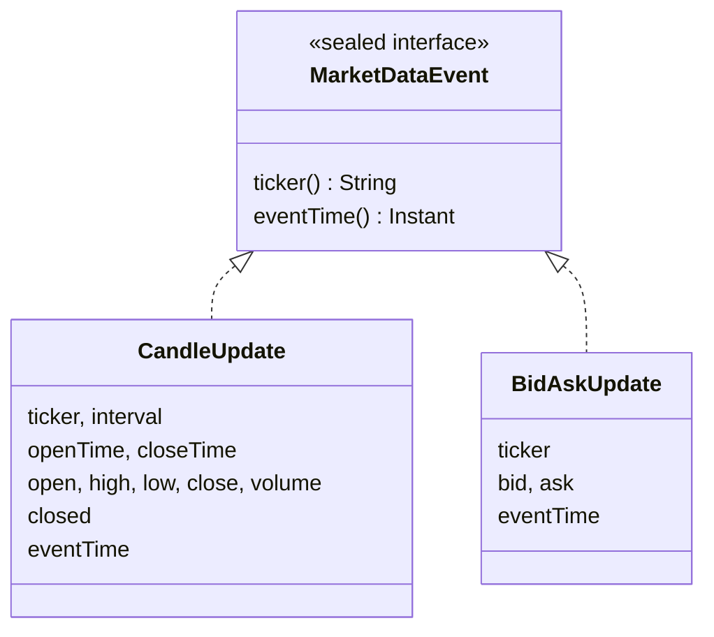
```mermaid
classDiagram
    class MarketDataEvent {
        <<sealed interface>>
        ticker() String
        eventTime() Instant
    }
    class CandleUpdate {
        ticker, interval
        openTime, closeTime
        open, high, low, close, volume
        closed
        eventTime
    }
    class BidAskUpdate {
        ticker
        bid, ask
        eventTime
    }
    MarketDataEvent <|.. CandleUpdate
    MarketDataEvent <|.. BidAskUpdate
```

Every event time is on the **exchange's clock**:

| Event | Where `eventTime` comes from |
|---|---|
| Live `CandleUpdate` | Binance's event time (`"E"`) |
| History `CandleUpdate` | The candle's close time |
| `BidAskUpdate` | Binance's spot `@bookTicker` has no event time, so the receive time shifted by the exchange clock offset measured on start |

A `CandleUpdate` is the current state of the forming candle plus `closed`.
- **Trading:** the candle stream sends an update every 1–2 seconds. Each update becomes an event.
- **Training (planned):** the same updates are rebuilt from historical **`1s` candles**. They're aggregated into the forming candle of the chosen interval and emitted one second at a time. A day is about 86,400 `1s` candles, which is 87 requests.
- **Cache (planned):** historical candles are stored in the database after the first download, so re-runs use identical data and don't call Binance again.

### 4.8 Failure handling

| What fails | What happens |
|---|---|
| Unreadable message | Logged as a warning, the stream continues |
| Listener throws | Logged, the other listeners and later updates still run |
| Dispatch queue full | Update dropped with a warning; the price map is still updated |
| Connection drops or errors | Reconnect after a fixed 5 seconds |
| Reconnect itself throws | The next reconnect is scheduled |
| Answering a ping fails | Logged, the stream continues |
| Server time unavailable on start | Local clock used, warning logged |
| A connection fails during `start()` | Everything opened so far is closed and the error is passed on |

### 4.9 Binance endpoints (public, no key needed)

Live streams come from the **demo** stream host, so the price map shows the prices that demo orders fill at. Candle history comes from **real** Binance data, so Training learns on real prices.

| Endpoint | Used for |
|---|---|
| `wss://demo-stream.binance.com/stream?streams=…` | `<symbol>@kline_<interval>` candles and `<symbol>@bookTicker` best bid/ask, JDK `java.net.http.WebSocket` |
| `GET /api/v3/klines` on `data-api.binance.vision` | Candle history, 1,000 per request |
| `GET /api/v3/time` | Exchange clock offset |
| `GET /api/v3/exchangeInfo` | Trading rules per symbol: the `LOT_SIZE` step and the `NOTIONAL` (or older `MIN_NOTIONAL`) minimum order value, read once per ticker |

## 5. Ticker price map (built)

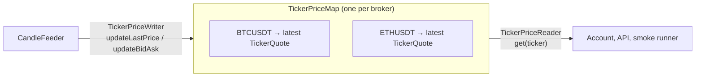
```mermaid
flowchart LR
    Feeder["CandleFeeder"] -- "TickerPriceWriter<br/>updateLastPrice / updateBidAsk" --> Map

    subgraph Map["TickerPriceMap (one per broker)"]
        direction TB
        B["BTCUSDT → latest TickerQuote"]
        E["ETHUSDT → latest TickerQuote"]
    end

    Map -- "TickerPriceReader<br/>get(ticker)" --> Readers["Account, API, smoke runner"]
```

Each broker has a `TickerPriceMap`: its configured tickers mapped to the latest `TickerQuote` (bid, ask, last price, update time, source).
- The key set is fixed at startup. Each value starts **empty** and is filled only by a valid REST fetch or a WebSocket message for that ticker. Updates for other tickers are ignored.
- Values are `AtomicReference<TickerQuote>`s, so updates are lock-free and readers never see a half-written quote.
- A candle update sets the last price; a bid/ask update sets bid and ask. Each keeps the other's fields.
- **`TickerPriceWriter`:** only the broker's `CandleFeeder` receives it.
- **`TickerPriceReader`:** every other component receives it. Read-only by type.
- **Training mode (planned):** the feeder must not run ahead of the bot, so in Training it releases events one at a time and writes each price only as it releases that event. The map never shows a "future" price.

## 6. Signals (planned)

> Superseded by §16.2: a `TradingAlgorithm` produces the signals and `OrderCheckerService` decides on the order (§16.3). The table below is the original idea.

`SignalGenerator.onUpdate(CandleUpdate, SignalContext)` runs on **every candle update** in both modes. `SignalContext` gives read-only access to recent candles, indicators, the open position and the cash balance.

| Signal | Parameters | Meaning |
|---|---|---|
| `Buy` | size (quantity or quote amount) | Open or add to a position |
| `Sell` | size (quantity, or all) | Reduce or close a position |
| `Hold` | none | Do nothing |

Indicators (SMA, EMA, RSI, …) are separate, reusable classes under `signal/indicator`.

## 7. Orders

### 7.1 Demo account orders (built)

Real market orders go to a **Binance Demo Mode** account: fake funds, with the same features and trading rules as the live exchange. For now they are placed by hand through the REST API. The bot will use the same `OrderService` later.

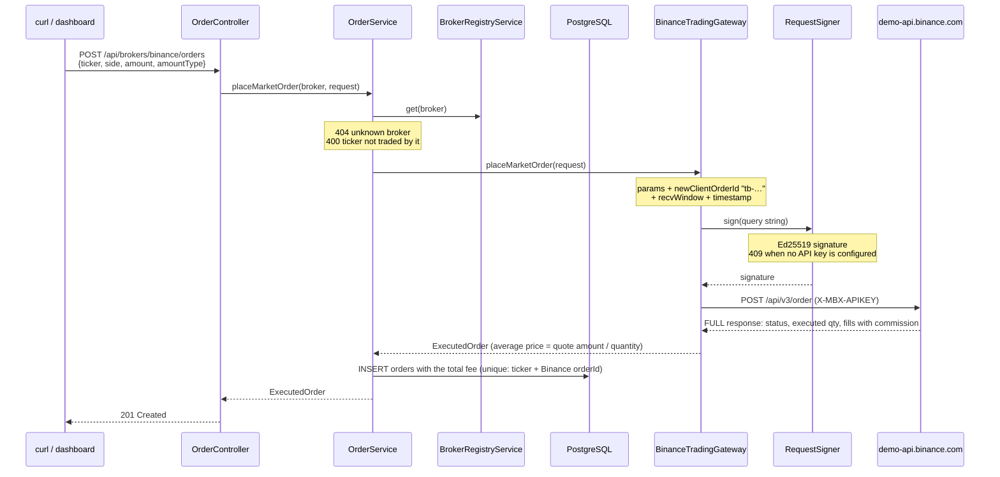
```mermaid
sequenceDiagram
    participant C as curl / dashboard
    participant API as OrderController
    participant S as OrderService
    participant R as BrokerRegistryService
    participant D as PostgreSQL
    participant G as BinanceTradingGateway
    participant K as RequestSigner
    participant B as demo-api.binance.com

    C->>API: POST /api/brokers/binance/orders<br/>{ticker, side, amount, amountType}
    API->>S: placeMarketOrder(broker, request)
    S->>R: get(broker)
    Note over S: 404 unknown broker<br/>400 ticker not traded by it
    S->>G: placeMarketOrder(request)
    Note over G: params + newClientOrderId "tb-…"<br/>+ recvWindow + timestamp
    G->>K: sign(query string)
    Note over K: Ed25519 signature<br/>409 when no API key is configured
    K-->>G: signature
    G->>B: POST /api/v3/order (X-MBX-APIKEY)
    B-->>G: FULL response: status, executed qty, fills with commission
    G-->>S: ExecutedOrder (average price = quote amount / quantity)
    S->>D: INSERT orders with the total fee (unique: ticker + Binance orderId)
    S-->>API: ExecutedOrder
    API-->>C: 201 Created
```

**Request:**

| Field | Values | Binance parameter |
|---|---|---|
| `ticker` | one of the broker's configured tickers | `symbol` |
| `side` | `BUY`, `SELL` | `side` |
| `amount` | greater than zero | |
| `amountType` | `QUOTE_AMOUNT`: spend or receive this much USDT | `quoteOrderQty` |
| | `BASE_QUANTITY`: buy or sell this much of the coin | `quantity` |

**Order ids:** Binance's `orderId` is the primary key of every live order table. `placeMarketOrder` takes no id. The Binance gateway sends its own `newClientOrderId` (`tb-` plus a random UUID) only to mark the order as the bot's, so orders placed by hand on the website can be told apart. Training mode will create its own ids inside its virtual gateway.

Nothing is written before sending: an order is stored once Binance answers.

**Outcomes:**

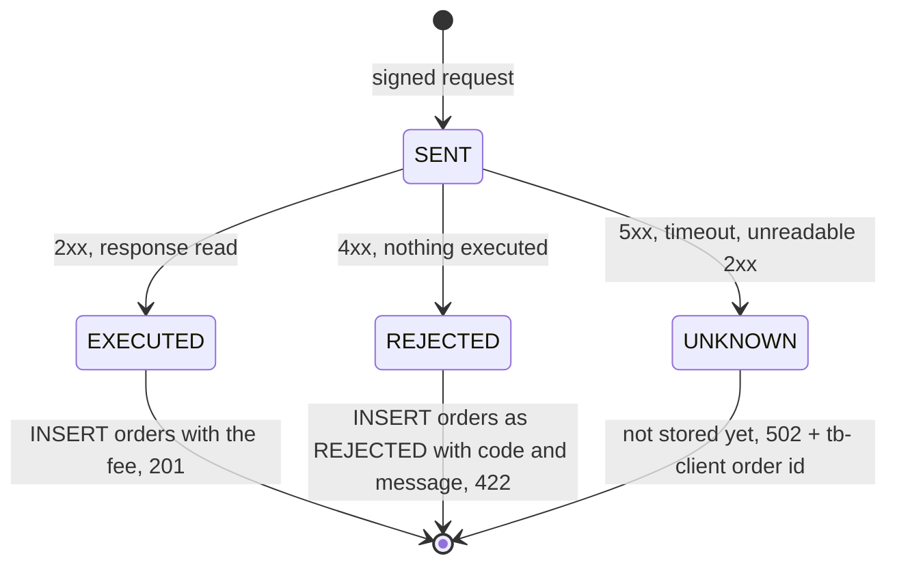
```mermaid
stateDiagram-v2
    [*] --> SENT: signed request
    SENT --> EXECUTED: 2xx, response read
    SENT --> REJECTED: 4xx, nothing executed
    SENT --> UNKNOWN: 5xx, timeout, unreadable 2xx
    EXECUTED --> [*]: INSERT orders with the fee, 201
    REJECTED --> [*]: INSERT orders as REJECTED with code and message, 422
    UNKNOWN --> [*]: not stored yet, 502 + tb- client order id
```

- **Unknown outcome:** Binance may still have executed it. The planned reconciliation step records it from the user data stream's `executionReport` (which carries Binance's `orderId`) or from a startup check of the bot's recent `tb-` orders.
- **Database fails after execution:** the answer is still 201 and the error is logged. The same reconciliation step fills the gap.

| Where the order is | Status |
|---|---|
| `orders` with status `NEW` or `PARTIALLY_FILLED` | Orders Binance acknowledged that still rest on the book (`NEW`, `PARTIALLY_FILLED`). Market orders never stay open; this fills up once take-profit and stop-loss orders exist |
| `orders` with any other status, no error | Executed: Binance's final status (`FILLED`, `EXPIRED`, …), with the total fee |
| `orders` with status `REJECTED` | Refused by Binance: its error code and message |

| Failure | Example | HTTP |
|---|---|---|
| Binance refused the order | `-2010` insufficient balance, `-1013` `LOT_SIZE` / `NOTIONAL` filter, `-1021` timestamp outside `recvWindow`, `-2015` bad key | 422, with `exchangeErrorCode` |
| No answer, or a server error | timeout, connection reset, 5xx. Binance may still have executed it | 502, with `clientOrderId` |
| Balances unreachable | timeout, 5xx | 502 |
| Unreadable request body, or an amount of zero or less | | 400 |

**Safety:**
- `BinanceTradingProperties` refuses to start unless `binance.trading.rest-url` points to `binance.trading.demo-host` (`demo-api.binance.com`). `BinanceUserDataStreamProperties` does the same for the user data stream (`demo-ws-api.binance.com`).
- The API key and the path to the Ed25519 private key come only from the environment variables `BINANCE_DEMO_API_KEY` and `BINANCE_DEMO_PRIVATE_KEY_PATH`. Without them, `BinanceTradingConfiguration` provides a `MissingKeyRequestSigner`: nothing is sent to Binance and the order and balance endpoints answer 409.
- `GET /api/brokers/{broker}/balance` answers `{"balances": [{"asset", "free", "locked"}, …]}`, non-zero balances only.
- A key file that can't be read stops the application at startup.
- Timestamps use the local clock. Binance accepts requests that arrive within `recv-window` (5 seconds) of it.

**Not covered yet:** rounding quantities to the symbol's step size and checking the minimum order value (via `exchangeInfo`). Binance rejects such orders with a filter failure, which comes back as a 422. Orders with an unknown outcome are settled from Binance by the reconciliation step that comes next (§11).

### 7.2 Account balances: cache and user data stream (built)

To send as few requests to Binance as possible, balances are never read from Binance per request. `BalanceCachingTradingGateway` keeps them in an `AccountBalanceCache`, and Binance's **user data stream** keeps that cache in sync. Binance is the source of truth: the cache only ever holds numbers Binance sent, never values computed from what an order was expected to do.

The user data stream has its own connection, separate from the market data streams, because Binance separates them too: a different host (`demo-ws-api.binance.com`, the WebSocket API), a signed subscription and private account data. The `userdata` package has its own `UserDataStreamConnection`, with a fixed 5-second reconnect.

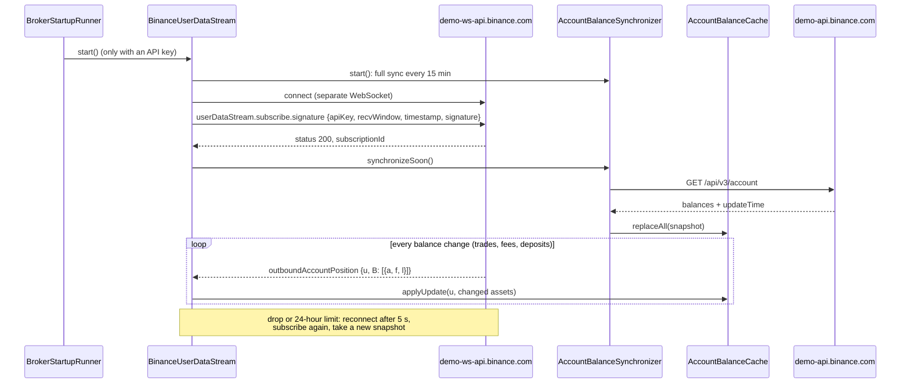
```mermaid
sequenceDiagram
    participant R as BrokerStartupRunner
    participant S as BinanceUserDataStream
    participant W as demo-ws-api.binance.com
    participant Y as AccountBalanceSynchronizer
    participant C as AccountBalanceCache
    participant A as demo-api.binance.com

    R->>S: start() (only with an API key)
    S->>Y: start(): full sync every 15 min
    S->>W: connect (separate WebSocket)
    S->>W: userDataStream.subscribe.signature {apiKey, recvWindow, timestamp, signature}
    W-->>S: status 200, subscriptionId
    S->>Y: synchronizeSoon()
    Y->>A: GET /api/v3/account
    A-->>Y: balances + updateTime
    Y->>C: replaceAll(snapshot)
    loop every balance change (trades, fees, deposits)
        W-->>S: outboundAccountPosition {u, B: [{a, f, l}]}
        S->>C: applyUpdate(u, changed assets)
    end
    Note over S,W: drop or 24-hour limit: reconnect after 5 s,<br/>subscribe again, take a new snapshot
```

| Source | When | Requests |
|---|---|---|
| Snapshot | after every successful subscription (startup and each reconnect) | 1 |
| `outboundAccountPosition` event | every balance change. It carries absolute `free`/`locked` values for the changed assets only | 0 |
| Safety sync | every `balance-sync-interval` (15 min), fixed rate | 1 |
| `GET /balance` | answered from the cache. Only an empty cache loads a snapshot | 0 |
| Executed order | the stream reports the new balances | 0 |
| Order with unknown status | the cache is cleared and reloaded on the next read | 0 now, 1 later |

**Ordering:** every cached asset remembers the update time it came with (`u` for events, `updateTime` for snapshots). An event or snapshot older than what is cached for that asset is ignored. A snapshot drops assets it no longer lists unless the cache has a newer event for them. Events that arrive before the first snapshot are kept and merged.

**Failures:**
- **Failed sync:** logged, then retried **once** after `balance-sync-retry-delay` (10 seconds). If the retry fails too, it's logged and the next regular sync runs on its usual 15-minute schedule. The retry never moves that schedule.
- **Stream drops:** events sent while disconnected are lost, because Binance doesn't replay them. The reconnect therefore subscribes again and takes a new snapshot.
- **Subscription refused** (e.g. `-2015`): logged. The safety sync still keeps the cache correct.
- **`eventStreamTerminated`:** subscribe again on the same connection.
- **Unreadable messages:** logged and skipped. The stream keeps reading.
- **No API key:** the stream and the sync don't start, and the endpoints answer 409.

`executionReport` events (one per order update, keyed by `clientOrderId`) are logged for now. A later step can use them to settle orders whose REST answer timed out (status unknown).

### 7.3 Order lifecycle in the bot (planned, first version: market orders only)

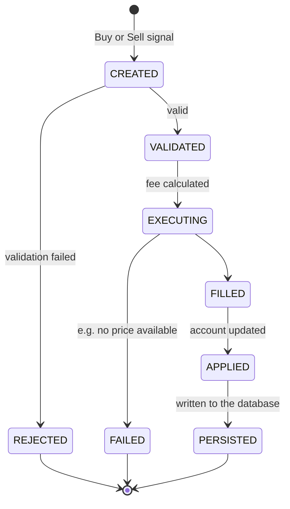
```mermaid
stateDiagram-v2
    [*] --> CREATED: Buy or Sell signal
    CREATED --> VALIDATED: valid
    CREATED --> REJECTED: validation failed
    VALIDATED --> EXECUTING: fee calculated
    EXECUTING --> FILLED
    EXECUTING --> FAILED: e.g. no price available
    FILLED --> APPLIED: account updated
    APPLIED --> PERSISTED: written to the database
    REJECTED --> [*]
    FAILED --> [*]
    PERSISTED --> [*]
```

| State | Set by | Meaning |
|---|---|---|
| `CREATED` | `TradingBotService` | Built from a `Buy` or `Sell` signal |
| `VALIDATED` | `OrderValidator` | Passed all checks |
| `REJECTED` | `OrderValidator` | Failed a check, with a reason. Logged and kept for the dashboard |
| `EXECUTING` | `OrderExecutionService` | Fill in progress |
| `FILLED` | `OrderExecutionService` | Price and quantity are final |
| `FAILED` | `OrderExecutionService` | Couldn't be filled. The bot goes to `ERROR` if it repeats |
| `APPLIED` | `AccountService` | Cash and position updated |
| `PERSISTED` | Repository | Saved. Only now is the next event allowed to depend on it |

**Rejection reasons:**
- `INSUFFICIENT_FUNDS`
- `INSUFFICIENT_HOLDINGS` (selling more than is held)
- `NO_POSITION` (selling with nothing open)
- `BELOW_MIN_QUANTITY` / `BELOW_MIN_NOTIONAL` (Binance `exchangeInfo` rules)
- `BOT_NOT_RUNNING`

Quantities are rounded down to the symbol's step size before validation.

### 7.4 Fill price

| Mode | Buy | Sell |
|---|---|---|
| `TRADING` | Best **ask** at the moment of the signal (`bookTicker`) | Best **bid** |
| `TRAINING` | Open of the next `1s` candle after the signal | Same |

### 7.5 Fees

`FeeService` uses the exact rates from Binance's signed `GET /api/v3/account/commission` when a **read-only** API key is configured. The key comes from environment variables and is never committed. Without a key, it uses the standard schedule: 0.1% maker and 0.1% taker.
- Market orders pay the taker rate.
- The fee is charged in the received asset: the base coin on a buy, the quote coin on a sell.
- Rates are cached and refreshed periodically. Calculating a fee is a direct call.

### 7.6 Later order types

These plug into the same lifecycle:
- `LIMIT`, `STOP_LOSS` and `TAKE_PROFIT` orders, plus their `*_LIMIT` variants.
- OCO brackets and trailing stops.
- Time in force (`GTC`, `IOC`, `FOK`).

They add a `PENDING` state, held in an in-memory open-orders book and checked on every update:

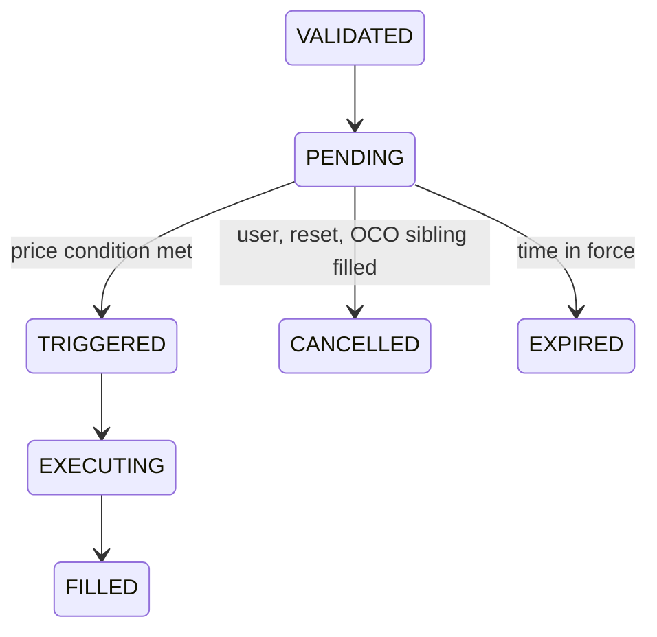
```mermaid
stateDiagram-v2
    VALIDATED --> PENDING
    PENDING --> TRIGGERED: price condition met
    TRIGGERED --> EXECUTING
    EXECUTING --> FILLED
    PENDING --> CANCELLED: user, reset, OCO sibling filled
    PENDING --> EXPIRED: time in force
```

## 8. Positions and trades (in progress)

Every executed order of a run, live or training, goes through one `PositionTracker`. It keeps the bot's position at **average cost**: the coins held and what they cost. A buy adds its coins and its cost. A sell takes coins out at the average cost per coin: buy 1 at 100 and 1 at 120, sell 1 at 130, and the sell makes 20 while 1 coin stays at an entry price of 110. The position closes when nothing is left, or when what is left is worth less than the minimum order value at the sell price: that rest (what the lot step leaves after "sell everything") can never be sold, so it leaves the position and stays in the account.

> **The lot step** (`TickerTradingRules.lotStepSize`) is Binance's `LOT_SIZE` rule: the smallest amount a coin quantity can change by. For BTCUSDT it is 0.00001 BTC, so an order for 0.123456 BTC is sent as 0.12345 BTC.

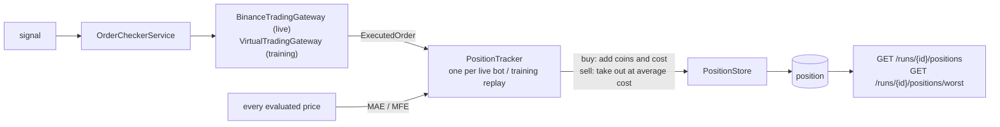
```mermaid
flowchart LR
    Signal["signal"] --> Checker["OrderCheckerService"]
    Checker --> Gateway["BinanceTradingGateway (live)<br/>VirtualTradingGateway (training)"]
    Gateway -- "ExecutedOrder" --> Tracker["PositionTracker<br/>one per live bot / training replay"]
    Price["every evaluated price"] -- "MAE / MFE" --> Tracker
    Tracker -- "buy: add coins and cost<br/>sell: take out at average cost" --> Store["PositionStore"]
    Store --> Db[("position")]
    Db --> Api["GET /runs/{id}/positions<br/>GET /runs/{id}/positions/worst"]
```

- **`position`** (table in §11): from the first buy while flat until the last coin is sold. One position is open per bot at a time. `PositionTracker` keeps the coins held and their cost in memory; the table stores the position's cost, realised P&L, MAE and MFE.
- **Fees:**
  - A buy's fee is taken from the coins bought, on Binance and in the virtual gateway. The coins held are what was received, and the cost is the USDT spent, so the fee is in the entry price.
  - A sell's fee is in USDT.
  - Realised P&L of a sell = exit price × quantity sold − their share of the cost − the sell fee. A sell of more than is held counts only what is held.
- **MAE and MFE:** the worst and best unrealised P&L of the open position, price × quantity − cost, updated on every evaluated price. Stored with every position write.
- **Writes:**
  - **Live:** after an order executes, the position row is written.
  - **Training:** kept in memory and written with the run's end, in the same transaction.
  - If the write fails, the order still happened: it is logged with its exchange order id and the tracker keeps the position in memory.
- **A live settings change** starts a new run (§16.4). The open position carries over and stays with the run it opened in.
- **Not kept:** a live bot starts flat. A position left open by a stop or a restart is not loaded again; the coins stay in the account. Per-sell trades are not stored; the executed orders in `orders` are the record.
- **API:** `GET /api/brokers/{broker}/runs/{id}/positions`: every position of the run, open ones included, the newest first (the dashboard's Trades view). `GET /api/brokers/{broker}/runs/{id}/positions/worst?limit=10`: the run's closed positions with the lowest realised P&L. Both carry MAE, MFE and duration.
- **Money:** all amounts and quantities are `BigDecimal` / `numeric`.

## 9. Bot and run lifecycle (planned)

### Bot mode (built)

The bot mode is application state, not a Spring profile, so it can be switched with one button without restarting the application. `bot.mode` in `application.yaml` sets the mode at startup; `BotModeService` holds it after that.

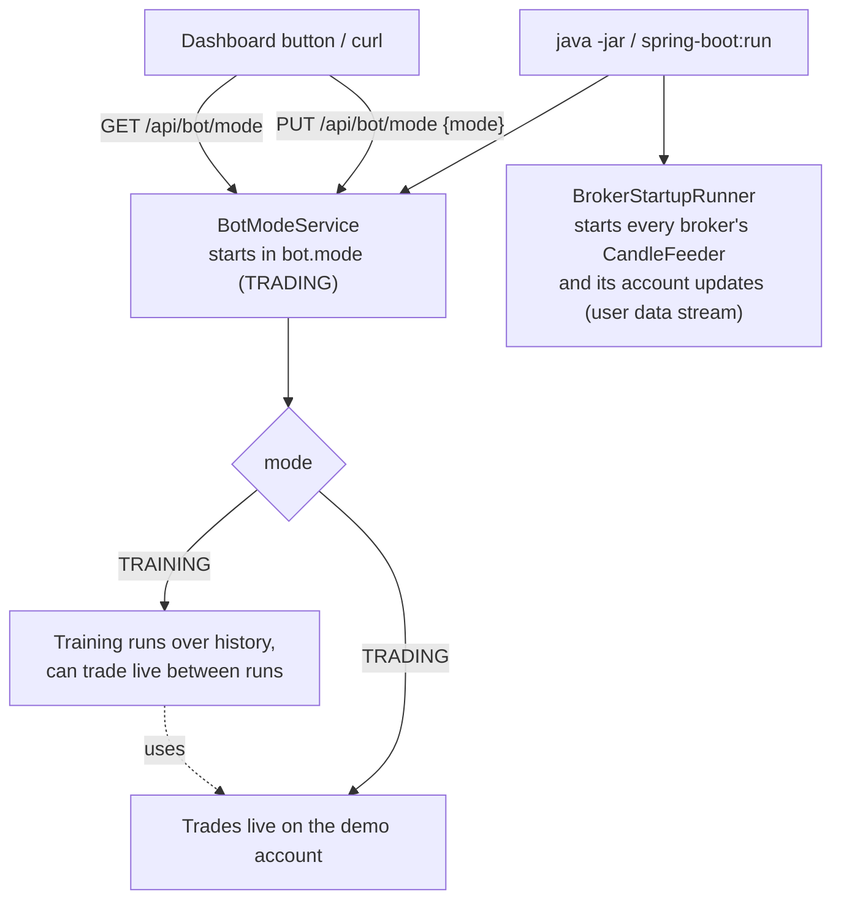
```mermaid
flowchart TD
    Start["java -jar / spring-boot:run"] --> Init["BotModeService<br/>starts in bot.mode (TRADING)"]
    Start --> Live["BrokerStartupRunner<br/>starts every broker's CandleFeeder<br/>and its account updates (user data stream)"]
    Ui["Dashboard button / curl"] -- "PUT /api/bot/mode {mode}" --> Init
    Ui -- "GET /api/bot/mode" --> Init
    Init --> Mode{"mode"}
    Mode -- TRADING --> T["Trades live on the demo account"]
    Mode -- TRAINING --> Tr["Training runs over history,<br/>can trade live between runs"]
    Tr -. uses .-> T
```

- **Training uses trading, not the other way around.** A training session iterates over several training runs and can trade live in between, so the live streams and the trading gateway are available in both modes. Live streams always start at startup.
- Switching only changes the stored mode for now. Once `TradingBotService` exists, it reads the mode to decide what to run.
- The only remaining profile is `smoke`: `MarketDataSmokeRunner` streams for `smoke.duration`, logs what it receives, then shuts the application down.
- The application context test replaces `BrokerStartupRunner` with a mock, so tests never open a network connection.

> The live bot and recorded runs are described in §16.5 and §16.4; pause, resume and reset below are not part of that first version.

### Bot states

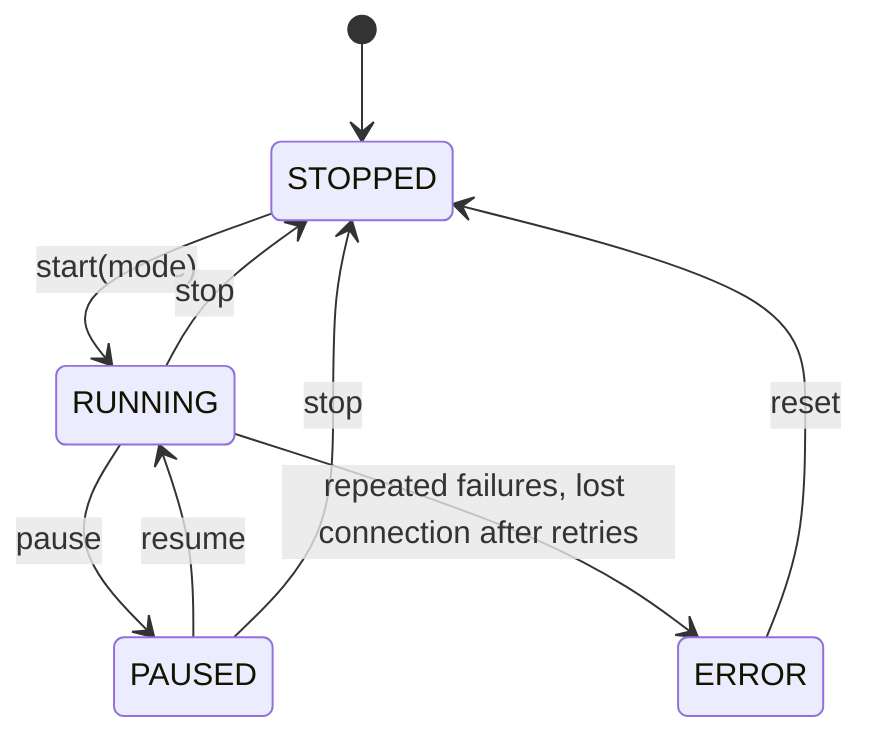
```mermaid
stateDiagram-v2
    [*] --> STOPPED
    STOPPED --> RUNNING: start(mode)
    RUNNING --> PAUSED: pause
    PAUSED --> RUNNING: resume
    RUNNING --> STOPPED: stop
    PAUSED --> STOPPED: stop
    RUNNING --> ERROR: repeated failures, lost connection after retries
    ERROR --> STOPPED: reset
```

| Control | Allowed from | Effect |
|---|---|---|
| `start(mode, options)` | `STOPPED` | Creates a run and starts the feed |
| `pause` | `RUNNING` | Stops processing. Live updates arriving while paused are dropped |
| `resume` | `PAUSED` | Continues processing |
| `stop` | `RUNNING`, `PAUSED` | Ends the run |
| `reset` | any | Stops and restores the starting balance. A new run is created on the next start |
| switch mode | `STOPPED`, `PAUSED` | Stops the current run and starts one in the other mode |

### Run states

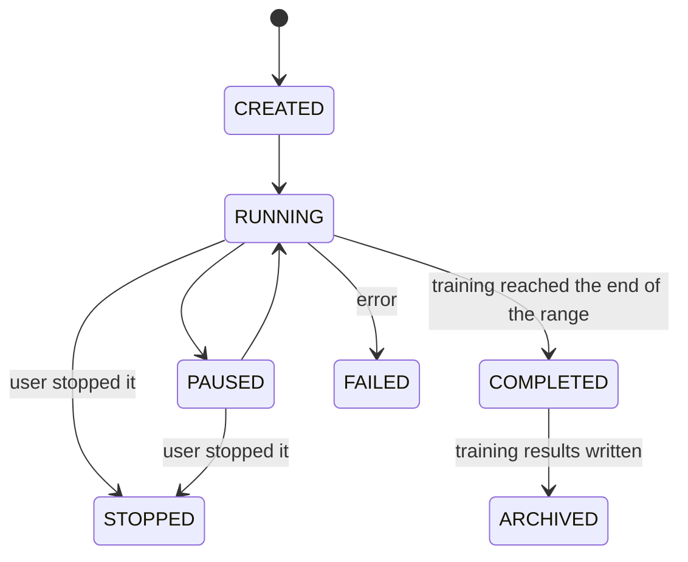
```mermaid
stateDiagram-v2
    [*] --> CREATED
    CREATED --> RUNNING
    RUNNING --> PAUSED
    PAUSED --> RUNNING
    RUNNING --> COMPLETED: training reached the end of the range
    RUNNING --> STOPPED: user stopped it
    PAUSED --> STOPPED: user stopped it
    RUNNING --> FAILED: error
    COMPLETED --> ARCHIVED: training results written
```

### Training options

Both options replay **as fast as possible**. A backtest over 1.5 years takes minutes, not 1.5 years.
- **Archived (the default):** keeps everything in memory, and writes all trades and snapshots in one transaction when the run completes. The results are viewable afterwards.
- **`live`:** the run is observable while it's in progress. Every trade is written immediately, and progress is pushed to the dashboard as it happens (see §12):
  - progress: the simulated time reached and the % of the range done
  - the portfolio value chart, growing as the run advances
  - the trades appearing in the history table and on the price chart
  - the current top 10 worst positions (see Position review below), updated as positions close

### Position review (both modes)

- Every closed position is kept as a **position record**:
  - entry and exit trades, with their times and prices
  - realised P&L (absolute and %) and duration
  - **MAE** (maximum adverse excursion: the worst unrealised loss while it was open)
  - **MFE** (maximum favourable excursion: the best unrealised profit while it was open)
- **Top 10 worst positions:** closed positions ranked by realised P&L. Each one can be opened as a chart showing:
  - the price path from a little before the entry to a little after the exit, from the candle cache
  - the entry and exit points marked
  - the MAE and MFE points marked

  This shows where the bot entered, where it sold, what happened in between, and what it could have done instead.

## 10. Concurrency

**Built (market data):**
- One WebSocket thread per connection: parses, updates the price map, offers to the queue. Never blocks.
- One dispatcher thread per feeder: delivers `CandleUpdate`s to listeners in arrival order.
- One shared scheduler thread for reconnects.
- The price map is lock-free (`AtomicReference` per ticker); readers on any thread see whole quotes.

**Planned (bot):**
- **Events:** the `PriorityBlockingQueue` is ordered by **execution time**, the moment each event should be processed.
- **First version:** a single worker thread processes events in order. Every order is validated against the latest account state.
- **Later:** a multi-threaded `TradingBotService`:
  - **In parallel:** signal generation, per ticker.
  - **Serialised:** account changes go through a single applier in execution-time order, so the shared cash balance can't be spent twice.
  - **Results:** they depend only on the execution-time order, never on thread timing.
- **Other threads:** the WebSocket callbacks, the REST controls and the REST reads only touch the queue, the bot state, or concurrent and read-only views.

## 11. Database (orders built, the rest planned)

- **PostgreSQL 17** holds every table. Locally it runs from `backend/compose.yaml` (Docker), which Spring Boot's Docker Compose support starts on `spring-boot:run` and leaves running. Tests use Testcontainers.
- **Flyway** creates the tables at startup from numbered raw-SQL scripts in `backend/src/main/resources/db/migration`, one per area: `V1__create_broker_and_ticker_tables.sql`, `V2__create_candle_table.sql`, `V3__create_algorithm_tables.sql`, `V4__create_algorithm_run_tables.sql`, `V5__create_position_tables.sql`, `V6__create_order_tables.sql`. Each script only creates what the schema needs: no table is created and dropped later, and no data is copied between tables. There's no ORM: the `database` package uses Spring's `JdbcClient` with plain SQL.
- **Brokers and tickers by id:** `brokers` holds one row per exchange. `ticker` belongs to a broker. Every other table points at `ticker_id` and never stores a broker or ticker as text; reads join `ticker` and `brokers` and give the domain records their names back.
- **Enums are native PostgreSQL ENUM types:** each Java enum has a `CREATE TYPE … AS ENUM` with the same names (`order_side`, `order_status`, `run_status`, …). Writes cast the name, `CAST(? AS order_side)`, so an unknown name is refused and nothing is written. Reads use `valueOf` on the text. This is the one PostgreSQL-only part of the schema.
- **Times as seconds:** an algorithm's timeframe and a candle's interval are stored in seconds (`timeframe_seconds`, `interval_seconds`). The API keeps the `5m` codes. A candle's close time is not stored: it is the open time + interval − 1 ms (`CandleInterval.closeTime`).

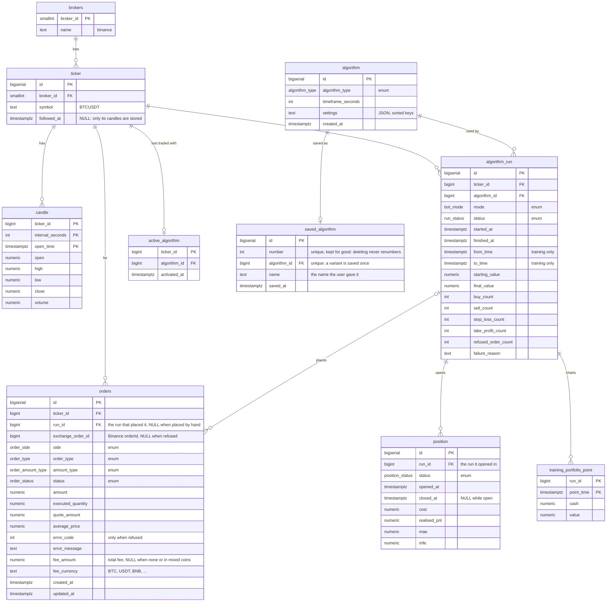
```mermaid
erDiagram
    brokers {
        smallint broker_id PK
        text name "binance"
    }
    ticker {
        bigserial id PK
        smallint broker_id FK
        text symbol "BTCUSDT"
        timestamptz followed_at "NULL: only its candles are stored"
    }
    candle {
        bigint ticker_id PK
        int interval_seconds PK
        timestamptz open_time PK
        numeric open
        numeric high
        numeric low
        numeric close
        numeric volume
    }
    algorithm {
        bigserial id PK
        algorithm_type algorithm_type "enum"
        int timeframe_seconds
        text settings "JSON, sorted keys"
        timestamptz created_at
    }
    algorithm_run {
        bigserial id PK
        bigint ticker_id FK
        bigint algorithm_id FK
        bot_mode mode "enum"
        run_status status "enum"
        timestamptz started_at
        timestamptz finished_at
        timestamptz from_time "training only"
        timestamptz to_time "training only"
        numeric starting_value
        numeric final_value
        int buy_count
        int sell_count
        int stop_loss_count
        int take_profit_count
        int refused_order_count
        text failure_reason
    }
    training_portfolio_point {
        bigint run_id PK
        timestamptz point_time PK
        numeric cash
        numeric value
    }
    active_algorithm {
        bigint ticker_id PK
        bigint algorithm_id FK
        timestamptz activated_at
    }
    saved_algorithm {
        bigserial id PK
        int number "unique, kept for good: deleting never renumbers"
        bigint algorithm_id FK "unique: a variant is saved once"
        text name "the name the user gave it"
        timestamptz saved_at
    }
    position {
        bigserial id PK
        bigint run_id FK "the run it opened in"
        position_status status "enum"
        timestamptz opened_at
        timestamptz closed_at "NULL while open"
        numeric cost
        numeric realised_pnl
        numeric mae
        numeric mfe
    }
    orders {
        bigserial id PK
        bigint ticker_id FK
        bigint run_id FK "the run that placed it, NULL when placed by hand"
        bigint exchange_order_id "Binance orderId, NULL when refused"
        order_side side "enum"
        order_type order_type "enum"
        order_amount_type amount_type "enum"
        order_status status "enum"
        numeric amount
        numeric executed_quantity
        numeric quote_amount
        numeric average_price
        int error_code "only when refused"
        text error_message
        numeric fee_amount "total fee, NULL when none or in mixed coins"
        text fee_currency "BTC, USDT, BNB, ..."
        timestamptz created_at
        timestamptz updated_at
    }
    brokers ||--o{ ticker : "lists"
    ticker ||--o{ candle : "has"
    ticker ||--o{ algorithm_run : "traded in"
    ticker ||--o| active_algorithm : "last traded with"
    ticker ||--o{ orders : "for"
    algorithm ||--o{ algorithm_run : "used by"
    algorithm_run ||--o{ training_portfolio_point : "charts"
    algorithm ||--o| saved_algorithm : "saved as"
    algorithm_run ||--o{ position : "opens"
    algorithm_run |o--o{ orders : "places"
```

Enum types: `algorithm_type`, `bot_mode`, `run_status`, `position_status`, `order_side`, `order_type`, `order_amount_type`, `order_status` (Binance's status names).

- **One `orders` table** holds open, executed and refused live orders, told apart by status: open = `NEW` or `PARTIALLY_FILLED`, refused = `REJECTED`. A refused order has an error code and no exchange order id; a `CHECK` keeps the two together. The bot's `tb-…` client order id is not stored. `run_id` tells who placed an order: the live run, or NULL for an order placed by hand (a test buy or sell).
- **Keys:** Binance's `orderId` is unique per symbol only, so an order is unique by `(ticker_id, exchange_order_id)`. An executed order keeps its total fee (`fee_amount`, `fee_currency`): the sum of its fills when they all paid in one coin. Fills paid in mixed coins (possible with the BNB fee discount) leave the fee empty, with a warning in the log. The fills themselves are not stored.
- Money and quantities are `numeric`, mapped to `BigDecimal`. Times are `timestamptz`.
- **`OrderRepository`:** method names follow the SQL they run: `insertExecutedOrder` (one order row), `insertRejectedOrder`, `getOpenOrders`, `getOrderHistory`, `getRejectedOrders`. Each read returns a record holding its list (`OpenOrderList`, `OrderHistory`, `RejectedOrderList`), which the service passes on. The controller wraps each in its own API response DTO (`OpenOrderListResponse`, `OrderHistoryResponse`, `RejectedOrderListResponse`, `AccountBalanceResponse`), so the JSON contract stays separate from the internal records.
- **Idempotent:** inserting the same executed order twice changes nothing: `insertExecutedOrder` first counts the rows with its ticker and exchange order id and skips an order that is already stored, in the same transaction as the inserts.
- **Plain SQL only:** queries use standard `SELECT`, `INSERT`, `UPDATE`, `DELETE`, `JOIN`, `WHERE`, `ORDER BY` and `LIMIT`, with `?` placeholders. No named parameters and no PostgreSQL-only clauses such as `ON CONFLICT`.
- **Failures:**
  - Database fails after Binance executed the order: the answer is still 201 and the error is logged. Reconciliation will fill the gap.
  - A failed insert stores nothing.
  - An unknown broker, or a name its enum type doesn't have, is refused and nothing is written.
  - Database down on a read: 503.
- **Endpoints:** `GET /api/brokers/{broker}/orders/open`, `GET /api/brokers/{broker}/orders/history` (the latest 100 executed orders, with their fee) and `GET /api/brokers/{broker}/orders/rejected` (the latest 100 rejected orders).

**Planned next (stacked PRs):**
- **Reconciliation:** `executionReport` events from the user data stream record any bot order (`tb-` client id) missing from the database, keyed by Binance's `orderId`. A startup check of Binance's recent orders covers the time the app was down.

**Planned later:**

| Table | Contents |
|---|---|
| `bot_run` | id, input hash, mode, symbol, interval, date range, generator and its parameters, starting balance, fee rates, status, timestamps |
| `portfolio_snapshot` | run id, time, cash, holdings value, total value |
| `candle` | symbol, interval, open time, OHLCV (historical data cache) |

**Write policy:**
- **Trading and live training:** each trade and its position change are written in **one transaction** before the next event is processed, so a crash never loses a confirmed trade. Snapshots are written in batches, and always on pause, stop and reset. They can be rebuilt from trades and candles.
- **Archived training:** everything is written once, at completion.

**Idempotency:**
- **Training:**
  - A run is identified by a hash of its inputs: mode, symbol, interval, date range, generator and parameters, starting balance and fee rates.
  - Processing is deterministic and uses cached candles, so identical inputs always give identical trades.
  - Re-running replaces the archived run instead of duplicating it.
- **Trading:**
  - Trades and events have deterministic ids (run id, execution time, sequence).
  - Unique constraints, plus inserts that ignore conflicts, mean a WebSocket reconnect that re-sends updates never creates duplicate trades.

## 12. REST API (orders built, the rest planned)

Everything is under `/api`. Errors are returned as RFC 9457 problem responses (`ProblemDetail`).

| Method | Path | Purpose |
|---|---|---|
| POST | `/brokers/{broker}/orders` | **Built.** Market order on the demo account (§7.1) |
| GET | `/brokers/{broker}/balance` | **Built.** `{"balances": […]}`, the non-zero balances of the demo account |
| GET | `/brokers/{broker}/orders/open` | **Built.** `{"openOrders": […]}`, orders resting on Binance (empty until take-profit and stop-loss orders exist) |
| GET | `/brokers/{broker}/orders/history` | **Built.** `{"orders": […]}`, the latest 100 executed orders with their fee |
| GET | `/brokers/{broker}/orders/rejected` | **Built.** `{"rejectedOrders": […]}`, the latest 100 orders Binance refused, with its error |
| GET | `/brokers/{broker}/tickers` | **Built.** `{"tickers": [{"ticker", "quote": {"bid", "ask", "lastPrice", "updatedAt", "source"}}, …]}`, every followed ticker with its latest quote from the ticker price map (`quote` is `null` until market data arrives) |
| POST | `/brokers/{broker}/tickers` | `{"ticker": "SOLUSDT"}`: follow one more ticker (§15.1). 400 when the exchange doesn't list it |
| GET, PUT | `/bot/mode` | **Built.** Read or switch the bot mode: `{"mode": "TRADING"}` or `{"mode": "TRAINING"}` |
| | §16.6 | **Algorithms, training runs, recorded runs and the live bot:** see the table in §16.6 |
| GET | `/bot/status` | State, mode, current run, latest price |
| POST | `/bot/start` | `{ "mode": "TRAINING", "from": …, "to": …, "live": false }` |
| POST | `/bot/pause`, `/bot/resume`, `/bot/stop`, `/bot/reset` | Controls |
| GET | `/runs`, `/runs/{id}` | Runs and their results |
| GET | `/runs/{id}/portfolio` | Current cash, positions and total value |
| GET | `/runs/{id}/portfolio/history` | Portfolio value over time |
| GET | `/runs/{id}/candles` | Price chart data, with trades marked on it |
| GET | `/runs/{id}/positions` | Every position of the run, the newest first (§8) |
| GET | `/runs/{id}/positions/worst?limit=10` | The worst closed positions, with P&L, MAE, MFE and duration (§8) |
| GET | `/runs/{id}/positions/{positionId}/chart` | The price path around one position, with the entry, exit, MAE and MFE marked |
| GET | `/runs/{id}/events` | Server-Sent Events stream of progress, trades, snapshots and position closes, for live training and trading |

## 13. Configuration

Everything goes in `backend/src/main/resources/application.yaml`. Current settings:

```yaml
spring:
  jackson:
    write:
      write-bigdecimal-as-plain: true         # 0.00000000, not 0E-8, in API answers
  http:
    clients:
      connect-timeout: 5s                     # every REST call to Binance
      read-timeout: 10s
  datasource:                                 # PostgreSQL; overridden by Docker Compose / Testcontainers
    url: ${TRADING_BOT_DB_URL:jdbc:postgresql://localhost:5432/tradingbot}
    username: ${TRADING_BOT_DB_USER:tradingbot}
    password: ${TRADING_BOT_DB_PASSWORD:tradingbot}
  docker:
    compose:
      lifecycle-management: start-only        # spring-boot:run starts backend/compose.yaml, leaves it running

bot:
  mode: TRADING                               # mode at startup; switched at runtime via PUT /api/bot/mode

binance:
  name: binance                               # broker name in the registry
  stream-url: wss://demo-stream.binance.com   # live candles and bid/ask (demo prices)
  rest-url: https://data-api.binance.vision   # candle history (real prices)
  interval: ONE_MINUTE                        # ONE_SECOND … ONE_DAY
  tickers:                                    # at least one
    - BTCUSDT
    - ETHUSDT
  trading:
    rest-url: https://demo-api.binance.com    # must point to demo-host, or startup fails
    demo-host: demo-api.binance.com
    api-key: ${BINANCE_DEMO_API_KEY:}
    private-key-path: ${BINANCE_DEMO_PRIVATE_KEY_PATH:}   # Ed25519 private key, PKCS#8 PEM
    recv-window: 5s
  user-data-stream:
    websocket-api-url: wss://demo-ws-api.binance.com/ws-api/v3   # must point to demo-host
    demo-host: demo-ws-api.binance.com
    balance-sync-interval: 15m                # full balance sync, fixed rate
    balance-sync-retry-delay: 10s             # one retry after a failed sync

smoke:
  duration: 30s                               # how long the smoke run streams
```

There are no mode profiles: the bot mode is switched at runtime (§9, Bot mode). The only profile is `smoke`, which needs no extra configuration file.

Planned additions: starting balance, the active signal generator and its parameters, and the default training range.

## 14. Package layout

Built packages are listed with their classes; the rest are planned. Public methods never return a bare `List`/`Set`/`Map`: they return a record holding it (`TickerList`, `BrokerList`, `OrderHistory`, …). The candle-history methods are still to be changed, together with the candle history work.

```
com.tihomir.t212.tradingbot
├── broker           Broker, AbstractBroker, BrokerRegistryService, BrokerList, BrokerNotFoundException,
│   │                RequestSigner, MissingKeyRequestSigner
│   └── binance      BinanceBroker, BinanceConnectionProperties, BinanceMarketDataProtocol,
│       │            BinanceTradingProperties, BinanceTradingConfiguration, BinanceTradingGateway,
│       │            BinanceRequestSigner, BinanceResponse, BinanceUserDataStream,
│       │            BinanceUserDataStreamProperties, BinanceUserDataSubscription
│       └── util     OrderUtil (order parameters, Binance order, balance and event JSON), QueryParameters
├── userdata         UserDataStreamConnection, UserDataStreamConnectionFactory, UserDataStreamHandler,
│                    JdkUserDataStreamConnection, JdkUserDataStreamConnectionFactory
├── marketdata
│   ├── update       MarketDataEvent, CandleUpdate, BidAskUpdate, CandleInterval
│   ├── tickerprice  TickerPriceMap, TickerPriceReader, TickerList, TickerPriceWriter, TickerQuote, TickerQuoteSource,
│   │                TickerPrice, TickerPriceList, TickerPriceService
│   ├── candlefeed   CandleFeeder, CandleUpdateListener, ExchangeMarketDataProtocol, StreamNameList
│   └── websocket    MarketDataStreamConnection, MarketDataStreamConnectionFactory, MarketDataMessageHandler,
│                    JdkWebSocketConnection, JdkWebSocketConnectionFactory
├── mode             BotMode, BotModeService, BrokerStartupRunner
├── smoke            MarketDataSmokeRunner (profile "smoke")
├── algorithm        TradingAlgorithm(List), AlgorithmType, SignalGenerator, TradingSignal,
│   │                AlgorithmRegistryService, AlgorithmSettingsService, AlgorithmStore
│   ├── settings     AlgorithmSettings, AlgorithmSettingDefinition(List), AlgorithmSettingValues,
│   │                AlgorithmSettingsRequest
│   ├── saved        SavedAlgorithm(List), SavedAlgorithmStore, SavedAlgorithmService
│   ├── indicator    SimpleMovingAverage, SimpleMovingAverageAlgorithm, SimpleMovingAverageSignalGenerator
│   └── exception    the algorithm and saved-settings exceptions
├── bot
│   ├── live         TradingBotService, LiveTradingBot, LiveTradingAccount, LiveSignalSource
│   ├── training     TrainingService, TrainingLock, TrainingReplay, TrainingSetup, TrainingRunRequest
│   ├── tuning       TuningService, TuningSession, TpeSampler, TuningRequest, TunedSettingRange,
│   │                TuningDimension(Kind), TuningDimensionValueDrawer, TuningPoint, TuningProgress,
│   │                TuningTrial, TuningResult
│   ├── run          AlgorithmRunService, AlgorithmRunStore, RecordedRun(List), RunCounts, RunDetails,
│   │                RunEnd, RunStart, RunStatus, SettingsSource, StoredRunDetails, UnrecordedRun,
│   │                UnfinishedRunCleanup, PortfolioPointList
│   ├── model        LiveBotStatus, LiveRunRequest, PortfolioPoint
│   └── exception    the bot, training and tuning exceptions
├── marketdata/history CandleHistoryService, CandleStore, CandleHistoryRequest, StoredCandleRange
├── order            OrderService, OrderStore, OrderCheckerService, OrderCheck, RejectionReason, AccountView
│   ├── model        ExecutedOrder, OpenOrder(List), OpenOrderStatus, OrderSide, OrderAmountType, OrderFee,
│   │                OrderFill, OrderHistory(Entry), RejectedOrder(List), MarketOrderRequest,
│   │                TickerTradingRules
│   ├── balance      AccountBalanceCache, AccountBalanceList, AccountBalanceSnapshot,
│   │                AccountBalanceSynchronizer, AssetBalance, CachedAssetBalance,
│   │                BalanceCachingTradingGateway
│   ├── gateway      ExchangeTradingGateway, VirtualTradingGateway
│   └── exception    the order and exchange exceptions
├── position         PositionTracker, PositionStore, Position, PositionStatus (§8)
├── database         OrderRepository (implements OrderStore; JdbcClient, raw SQL), OrderFillRow
│                    PositionRepository (position)
└── api              the controllers and ApiExceptionHandler
    ├── request      the request bodies (*Body)
    └── response     the response DTOs (*Response) and BotModeSetting
```

## 15. Frontend (dashboard built)

A React app in plain JavaScript (`.jsx`), HTML and CSS, in `frontend/`, built with Vite. In development the Vite server forwards `/api` to the backend on port 8080. The accent colour is `#00A7E1`; the logo is the project's own.

```mermaid
flowchart TB
    Header["Header<br/>live dot, Trading/Training switch, theme toggle"]
    Tickers["Ticker cards + Follow a ticker"]
    subgraph Sections["Tabs: Live bot | Training | Runs"]
        Live["Live bot panel<br/>ticker, settings form, start/stop,<br/>Edit, Save, Confirm<br/>+ portfolio value chart and counts"]
        Train["Training panel<br/>ticker, range, balance, settings form<br/>+ result chart and settings history"]
        Runs["Runs panel<br/>recorded runs, pick one for its chart"]
    end
    Account["Orders card + Holdings card"]
    Header --> Tickers --> Sections --> Account
```

| Part | Calls |
|---|---|
| Header | `GET / PUT /api/bot/mode` (409 while a live bot runs; the error shows under the switch) |
| Ticker cards | `GET /tickers` every 2 s; `POST /tickers` to follow one more |
| Settings form | `GET /algorithms` once: every algorithm and its setting definitions |
| Live bot panel | `GET /bot` every 2 s, `POST /bot/start`, `POST /bot/stop`, `PUT /bot/current-parameters` |
| Training panel | `POST /training/runs` |
| Runs panel | `GET /runs` every 10 s, `GET /runs/{id}` |
| Orders, Holdings | `GET /orders/history`, `/rejected`, `/open`, `/balance` every 5 s |

- **Settings form:** built from the algorithm's setting definitions (label, required, range, default). A required field left empty takes its default; an optional one left empty is off. `updateTimeSeconds` only shows when "Run on every price" is off. Settings that aren't shared go to `options`.
- **Live bot editing** follows §16.6: the running bot's settings are read only; Edit unlocks them, Save asks to confirm, Confirm sends them, Back and Cancel keep the bot as it is.
- **Charts** are plain SVG, with no chart library: portfolio value over time, the starting value as a dashed line, and the value under the mouse.
- **Polling:** each part polls its endpoint (`usePolling`). On a failed request it keeps its last data, and a banner says the backend is unreachable until it answers again.
- **Holdings** stand in for open positions until the positions work (average cost, PnL) exists. Each balance is valued with the last price of its `…USDT` ticker; assets that aren't followed show no value.
- **Mode switch:** it updates at once and reverts if `PUT /api/bot/mode` fails. It also opens the matching tab (Trading: Live bot, Training: Training).
- **Theme:** light or dark, from the system setting at first, then remembered in `localStorage`. Colours are CSS variables switched with `data-theme` on `<html>`.
- **Motion:** cards rise in, the mode switch and tabs slide, prices flash green or red when they move, and loading uses shimmering skeletons. All motion is turned off when the system asks for reduced motion.

| File | Role |
|---|---|
| `src/api.js` | Every REST call |
| `src/settings.js` | Settings form state to and from the API |
| `src/hooks/usePolling.js`, `useTheme.js`, `useBotMode.js` | Polling with last-good data; light and dark theme; the bot mode shared by the header and the panels |
| `src/components/` | `Header`, `ModeSwitch`, `ThemeToggle`, `TickerStrip`, `TickerCard`, `FollowTickerCard`, `LiveBotPanel`, `TrainingPanel`, `RunsPanel`, `RunDetails`, `SettingsForm`, `LineChart`, `OrdersCard`, `HoldingsCard`, `Logo` |
| `src/styles.css` | Design tokens for both themes, layout and animations |

### 15.1 Following tickers

`POST /api/brokers/{broker}/tickers` with `{"ticker": "SOLUSDT"}` follows one more ticker on top of the configured ones.

1. The body is checked with `@Valid`: 2 to 20 capital letters or digits.
2. `FollowedTickerService` asks the exchange for one page of candles. A 4xx answer means the exchange doesn't list the ticker (400); any other failure is 502. Nothing is stored in either case.
3. The ticker row gets a `followed_at` once (§11); a ticker stored only for its candles has none.
4. The broker adds it to its ticker price map, and the candle feeder reopens its connections with the new streams.

At startup, `BrokerStartupRunner` first stores the configured tickers as followed (a ticker already stored keeps its time), then adds the stored tickers before the streams open. If the database can't be read, startup goes on with the configured tickers only.

### 15.2 Live bot chart

The live bot keeps a portfolio point (time, free cash, and cash plus its position at the price) at most every 15 seconds, and at most 1,000 points; the oldest go first. `GET /bot` returns them as `points`. When the bot stops they are saved with the run, so `GET /runs/{id}` shows the chart of a stopped live run too.

## 16. Trading algorithm, training and the live bot

A trading algorithm turns prices into signals. The same algorithm runs in both modes:
- **Training:** over stored candles, on a virtual account, as fast as possible.
- **Trading:** live, on the Binance demo account.

Every order goes through one checker first. A run uses one algorithm variant. Its settings are kept in memory while it runs; the run is recorded when it starts and when it ends. A live settings change ends the run and starts a new one.

```mermaid
flowchart LR
    Ui["Dashboard<br/>training view, live bot panel"] -- "POST /training/runs" --> Train["TrainingService"]
    Ui -- "POST /bot/start, /bot/stop<br/>PUT /bot/current-parameters" --> Bot["TradingBotService"]
    Train -- "getCandles(...)" --> Hist["CandleHistoryService"]
    Hist --> CandleDb[("ticker, candle")]
    Hist -- "missing pages" --> Feeder["CandleFeeder"]
    Bot -- "closed candles, live prices" --> Feeder
    Train --> Algo["TradingAlgorithm<br/>signals only"]
    Bot --> Algo
    Train --> Checker["OrderCheckerService<br/>every order"]
    Bot --> Checker
    Checker -- "training" --> Virtual["VirtualTradingGateway"]
    Checker -- "trading" --> Orders["OrderService<br/>Binance demo account"]
    Train --> RunDb[("algorithm, algorithm_run,<br/>active_algorithm,<br/>training_portfolio_point")]
    Bot --> RunDb
```

### 16.1 Candle store

Candles are downloaded once and then read from the database.

```mermaid
erDiagram
    ticker {
        bigserial id PK
        smallint broker_id FK "unique with symbol"
        text symbol "e.g. BTCUSDT"
    }
    candle {
        bigint ticker_id PK
        int interval_seconds PK "e.g. 300 for 5m"
        timestamptz open_time PK
        numeric open
        numeric high
        numeric low
        numeric close
        numeric volume
    }
    ticker ||--o{ candle : "has"
```

- **Index:** the primary key `(ticker_id, interval_seconds, open_time)` is the index a period is read through.
- **Stored range:** the first and last stored candle of a ticker and interval, read through that same index (`MIN`/`MAX(open_time)`). No separate table is kept for it.
- **The stored candles are one block.** Downloads only ever extend it at its ends, so it has no holes.

```mermaid
flowchart TD
    Start["getCandles(broker, ticker, interval, from, to)"] --> Traded{"ticker traded<br/>by the broker?"}
    Traded -- no --> E400["400"]
    Traded -- yes --> Size{"range / interval<br/>at most 1,000,000 candles?"}
    Size -- no --> E400b["400"]
    Size -- yes --> Ticker["SELECT ticker row,<br/>INSERT it if missing"]
    Ticker --> Range["stored range:<br/>MIN / MAX(open_time)"]
    Range --> Before{"from before<br/>first stored candle?"}
    Before -- yes --> Back["page backward from the<br/>first stored candle to from"]
    Before -- no --> After
    Back --> After{"to after<br/>last stored candle?"}
    After -- yes --> Forward["page forward from the<br/>last stored candle to to"]
    After -- no --> Read
    Forward --> Read["SELECT candles in range<br/>(primary key range scan)"]
    Read --> Out["CandleList"]
```

- **Request:** `CandleHistoryRequest` is a plain internal record. Requests are checked where they enter, with nested `@Valid` request bodies (§16.6).
- **No forming candle:** `to` is clamped to the last closed candle, so a candle that is still forming is never stored.
- **Paging:**
  - Nothing stored yet: page forward from `from`.
  - Forward pages start right after the last stored candle, and stop on a short or empty page.
  - Backward pages end at the first stored candle. They stop at `from`, or on an empty page (no older candles exist).
- **Every page is one transaction.** An interrupted download keeps what it stored.
- **Stored rows are skipped** with plain `INSERT … SELECT … WHERE NOT EXISTS`.
- **One download at a time.**

| Failure | Result |
|---|---|
| Binance page request fails or times out | Stored pages stay, 502 |
| Unreadable page | Logged with ticker, interval and time, 502 |
| Database down | 503 |
| Range larger than 1,000,000 candles | 400 |

### 16.2 Algorithms and their settings

```mermaid
classDiagram
    class TradingAlgorithm {
        <<abstract>>
        type() AlgorithmType
        name() String
        displayName() String
        settingDefinitions() AlgorithmSettingDefinitionList
        resolveSettings(AlgorithmSettingsRequest) AlgorithmSettings
        createSignalGenerator(AlgorithmSettings) SignalGenerator
        warmUpCandles(AlgorithmSettings) int
        #checkOptionRules(AlgorithmSettings)
        #newSignalGenerator(AlgorithmSettings)* SignalGenerator
    }
    class SignalGenerator {
        <<interface>>
        onPrice(CandleUpdate) TradingSignal
    }
    class AlgorithmSettings {
        algorithmType, timePeriod, timeframe
        liveOnTick, updateTimeSeconds (optional)
        orderSizePercent
        stopLossPercent, takeProfitPercent (optional)
        options (the algorithm's own, optional)
    }
    class AlgorithmStore {
        <<interface>>
        findOrInsertAlgorithm(AlgorithmSettings, Instant) long
        getAlgorithm(long) AlgorithmSettings
    }
    class SimpleMovingAverageAlgorithm {
        type SIMPLE_MOVING_AVERAGE, name example-strategy-SMA
    }
    TradingAlgorithm <|-- SimpleMovingAverageAlgorithm
    TradingAlgorithm ..> SignalGenerator : creates one per run
    TradingAlgorithm ..> AlgorithmSettings : resolves
    AlgorithmStore ..> AlgorithmSettings : stores as variants
```

- **The algorithm only produces signals** (`BUY`, `SELL`, `HOLD`). It never sees the account. Whether a signal becomes an order is decided by `OrderCheckerService` (§16.3).
- **Required and optional settings:**
  - Every setting is described by an `AlgorithmSettingDefinition`: name, label, required, whole number, default, minimum and maximum. The dashboard builds its form from these.
  - **Required** settings always have a value: a missing one takes its default, and the value is range-checked.
  - **Optional** settings may be `null`. A `null` optional setting **skips every check that uses it**, including its range check.
- **Shared settings** (every algorithm):

| Setting | Required | Meaning |
|---|---|---|
| `timePeriod` | yes | Candles the algorithm looks back over |
| `timeframe` | yes | The candle interval as a code: `1m`, `5m`, `15m`, `1h`, `4h`, `1d` |
| `liveOnTick` | yes | Live: run on every price update |
| `updateTimeSeconds` | only when `liveOnTick` is false | Live: run every this many seconds. `null` when `liveOnTick` is true |
| `orderSizePercent` | yes | Share of the cash a buy spends |
| `stopLossPercent` | optional | Sell everything once the price falls this far below the average entry price |
| `takeProfitPercent` | optional | Sell everything once the price rises this far above the average entry price |

- **Adding an algorithm** takes two things:
  1. a value in `AlgorithmType`, and its number in the exhaustive `switch` of `AlgorithmRepository`
  2. a class extending `TradingAlgorithm` (a Spring bean)

  No migration is needed: its own settings go into the same JSON. `AlgorithmRegistryService` finds it and rejects duplicate types, and `GET /api/algorithms` lists it.
- **`example-strategy-SMA` (`SIMPLE_MOVING_AVERAGE`, number 1 in the database):** one simple moving average over `timePeriod` candles of the timeframe.
  - **BUY** when the price **moves below** the average. **SELL** when it **moves above** it.
  - Signals only fire when the price crosses to the other side, so it doesn't buy on every candle below the average.
  - It has no optional settings yet.

### 16.3 Order checks

```mermaid
flowchart TD
    Price["price update"] --> Stop{"stopLossPercent set<br/>and price at or below the stop?"}
    Stop -- yes --> ForcedSell["SELL everything"]
    Stop -- "no, or not set" --> Signal["algorithm: BUY / SELL / HOLD"]
    Signal -- HOLD --> Done["nothing"]
    Signal -- "BUY / SELL" --> Check["OrderCheckerService.checkOrder"]
    ForcedSell --> Check
    Check -- "Refused(reason)" --> Count["count + log, run goes on"]
    Check -- "Approved(order)" --> Gateway["virtual account (training)<br/>OrderService (trading)"]
```

- **The checker sees every order before it is placed.** Each optional check is skipped when its setting is `null`.
  - **BUY:** spends exactly `orderSizePercent` of the free cash, rounded down to the lot step. Refused with `INSUFFICIENT_FUNDS`, or `BELOW_MIN_ORDER_VALUE` (under the exchange's minimum, a named constant for now).
  - **SELL:** sells the whole position. Refused with `NO_POSITION` when nothing is held.
  - **Stop loss:** entry price × (1 − `stopLossPercent`). A price at or below it forces a sell of everything.
  - **Take profit:** entry price × (1 + `takeProfitPercent`). A price at or above it forces a sell of everything. Training checks it on the candle high; a candle that opens above it fills at its open.
  - **Both in one candle (training):** the stop loss is checked first and wins, the worse outcome, so a backtest never looks better than it could have been.
  - Stop-loss and take-profit sells are counted on their own (`stop_loss_count`, `take_profit_count`) and also as sells.
- **`AccountView`** provides cash, base quantity and entry price. Training reads the virtual account; trading reads the cached Binance balances (§7.2).
- **`VirtualTradingGateway`** implements the same `ExchangeTradingGateway` as Binance and follows the same rules. That is the swap: training never sends an order to Binance.
  - **Same rules:** training reads the ticker's `TickerTradingRules` (lot step, minimum order value) from Binance before the run is recorded, and gives them to the virtual gateway. Both gateways round base quantities down with `TickerTradingRules.roundDownToLotStep`.
  - **Market buys for a quote amount** buy whole lot steps only, so they spend a little less than asked, like Binance.
  - **Refusals use Binance's codes:** `-1013` for less than one lot step or below the minimum order value (`Filter failure: NOTIONAL`), `-2010` for an insufficient balance.
  - **Fees:** Binance's standard 0.1% taker fee, in the asset received: coins on a buy, USDT on a sell. Order ids are its own.

### 16.4 Recording algorithms and runs

```mermaid
erDiagram
    algorithm {
        bigserial id PK
        smallint algorithm_type "1 = example-strategy-SMA"
        text timeframe "code, e.g. 15m"
        text settings "JSON, every other setting"
        timestamptz created_at
    }
    algorithm_run {
        bigserial id PK
        text mode "TRAINING or TRADING"
        text broker
        text ticker
        bigint algorithm_id "FK to algorithm.id"
        text status "STARTED, COMPLETED, STOPPED, FAILED"
        settings_source settings_source "MANUAL or AUTOMATIC"
        timestamptz started_at
        timestamptz finished_at "NULL while running"
        timestamptz from_time "training only"
        timestamptz to_time "training only"
        numeric starting_value
        numeric final_value
        int buy_count
        int sell_count
        int stop_loss_count
        int take_profit_count
        int refused_order_count
        text failure_reason
    }
    active_algorithm {
        text broker PK
        text ticker PK
        bigint algorithm_id "FK to algorithm.id"
        timestamptz activated_at
    }
    training_portfolio_point {
        bigint run_id PK
        timestamptz point_time PK
        numeric cash
        numeric value
    }
    algorithm ||--o{ algorithm_run : "used by"
    algorithm ||--o{ active_algorithm : "active on"
    algorithm_run ||--o{ training_portfolio_point : "chart"
```

- **One row per algorithm variant** in `algorithm`: a type with one set of settings.
  - **Type:** `AlgorithmType` in the code and the API (`SIMPLE_MOVING_AVERAGE`), a `SMALLINT` in the database. `AlgorithmRepository` maps the two with an exhaustive `switch`. A number is never reused.
  - **Timeframe:** its code (`5m`), in the API and the database. `CandleInterval` keeps only its `Duration`; the code is derived from it.
  - **Settings:** every other setting, shared and the algorithm's own, as JSON text, parsed with Jackson. No JSON column type is used, so any database can hold it.
  - **Rows never change.** New settings are a new row, so a run always points at exactly the settings it used.
- **Identical variants are stored once:**
  - The JSON is written in one fixed form: keys sorted, numbers plain without trailing zeros (`1.00` is `1`), empty optional settings left out.
  - So identical settings give identical text, and saving looks for a row with the same type, timeframe and text. A match is reused; otherwise a row is inserted. `UNIQUE (algorithm_type, timeframe, settings)` backs this up.
- **Settings source:** `algorithm_run.settings_source` says who chose the variant: `MANUAL` (the user, in a training or live run) or `AUTOMATIC` (the tuner, §16.7). Rows from before the column read as `MANUAL`.
- **A run uses one variant** (`algorithm_run.algorithm_id`). The database is written twice:
  - **Start:** the run row (`STARTED`). A live run also sets its ticker's `active_algorithm`, in the same transaction.
  - **End:** status, counts, final value and points, in one transaction. The status is `COMPLETED`, `STOPPED` (stopped on request, or interrupted by a restart) or `FAILED` (with its reason).
- **Live settings change:** the running run ends as `COMPLETED` and a new run starts with the new variant, in one transaction. The new run starts at the old run's final value.
- **Active algorithm:** `active_algorithm` holds, per broker and ticker, the variant the live bot last traded it with. It stays after the bot stops. Variants themselves don't belong to a ticker, so one variant can be active on several tickers.
- **Restart:** at startup, runs still marked `STARTED` are set to `STOPPED`, "interrupted by restart". A live bot does not resume by itself.
- **Saved settings:** variants the user keeps to pick again, each under a name they type.
  - `saved_algorithm` points at a variant (`algorithm_id`, unique) with its `name` and `saved_at`. Saving settings finds or inserts their variant first; saving a variant that is already saved renames it instead of adding a second entry.
  - Removing an entry deletes only the `saved_algorithm` row. The variant stays, so runs that used it keep their settings.
  - Replacing an entry points it at the variant of the new settings and keeps its name, place and `saved_at`. If another entry already holds that variant, it is refused (409) instead of merging the two. The old variant stays.
  - Editing settings picked from the list never changes the entry: the form holds a copy. The training form's "Save current settings" saves them as a new entry, or, if they came from an entry and were changed, offers "Replace" for that entry.
  - The live bot form also offers "Current settings": whatever the training form holds right now.
  - Each entry gets a number when it is first saved (the highest so far plus one) and keeps it: deleting an entry leaves a gap instead of renumbering the others. The dashboard lists them as "1. name", "3. name", … by that number, in a scrollable dropdown on the training and the live bot form. Picking one fills the form; a tuning result can save its settings with a tick.

```mermaid
flowchart LR
    Tuning["Tuning result<br/>Save these settings"] -- "POST /algorithms/saved" --> Service["SavedAlgorithmService"]
    Forms["Training and live bot forms<br/>Saved settings dropdown"] -- "GET / DELETE" --> Service
    Service -- "find or insert variant" --> Algorithm[("algorithm")]
    Service -- "save, rename, remove" --> Saved[("saved_algorithm")]
```

### 16.5 When the algorithm runs

| | `liveOnTick = true` | `liveOnTick = false` |
|---|---|---|
| **Trading** | On every live price update, including the forming candle | Every `updateTimeSeconds`, on the latest price |
| **Training** | Once per stored candle of the timeframe | Once per stored candle of the timeframe |

- **Training:**
  1. Record the start.
  2. Read the candles with `getCandles`.
  3. Replay them in one thread with no waiting. For each candle: stop check, then signal, then order check, then fill at the **next** candle's open (no look-ahead). The portfolio value is thinned to at most 1,000 points.
  4. Record the end.

  Only one training run runs at a time.
- **Trading (`TradingBotService`, one live bot per broker):**
  - **Start** needs `TRADING` mode, otherwise 409. It loads `timePeriod` closed candles of the timeframe from the candle store, so the average is ready at once. Then it records the start and subscribes to the feeder. Every check (mode, ticker, settings, warm-up) runs before anything is recorded.
  - **Worker thread:** evaluations run on the bot's own thread with a bounded queue (100 prices), so the feeder's dispatcher never waits. A full queue drops the price with a warning. Orders go through `OrderService` to the demo account. Refusals and exchange rejections are counted and logged, and the bot goes on. Any other failure in an evaluation is logged and the next price is evaluated as usual.
  - **Longer timeframes:** the live feeder streams one interval from config (1 minute). Closed candles of a longer timeframe come from the candle store as each period closes; the live price is added on top as the forming candle. A failed read is retried at the next price, so no closed candle is skipped.
  - **Account:** cash is the account's free USDT. The position is only what the bot bought (less fees taken in coins), so a sell never touches coins the account held before. The bot tracks the position's average entry price for the stop loss.
  - **Lot step:** the smallest amount a coin quantity can change by, from the ticker's `LOT_SIZE` filter. Binance only takes base quantities that are a multiple of it: for BTCUSDT the step is 0.00001 BTC, so 0.123456 BTC is sent as 0.12345 BTC. `BinanceTradingGateway` reads the step once per ticker from `/api/v3/exchangeInfo` and rounds a base quantity down to it; if the step can't be read, nothing is sent. A sell closes the bot's position, and the rest below one step stays in the account.
  - **Stop** removes the listener, lets queued prices finish (up to 10 seconds) and records the end as `STOPPED`, with the final value at the latest price. On shutdown, running bots are stopped the same way.
  - **Mode switch:** refused with 409 while a bot runs.
  - **Pause and resume:** the bot keeps a `paused` flag in memory. While paused, it places **no orders at all**, not even a stop loss or take profit. Prices are still evaluated for the parts that don't trade: MAE and MFE, and the portfolio chart (the coins held still change in value). Signals are not computed. The run stays `STARTED` in the database, so no migration is needed. Pausing a paused bot or resuming a running one changes nothing. A settings change while paused keeps the bot paused. Stop works from either state. A restart forgets the flag, which is fine because running bots are stopped on shutdown.
  - **Reset:** Binance's demo account has no reset endpoint ("You can reset your balance whenever you want via the UI", Demo Mode docs). The dashboard's Reset button stops the bot if it runs, then opens Binance's demo wallet page in a new tab, where the user resets the balance. No backend change.

```mermaid
flowchart LR
    Feeder["CandleFeeder<br/>1-minute updates"] -- "liveOnTick" --> Queue["bounded queue"]
    Timer["timer<br/>every updateTimeSeconds"] -- "latest price" --> Queue
    Queue --> Worker["LiveTradingBot<br/>worker thread"]
    Worker --> Paused{"paused?"}
    Paused -- yes --> Track["MAE / MFE<br/>portfolio point<br/>no orders"]
    Paused -- no --> Stop{"stop loss<br/>reached?"}
    Stop -- yes --> Placer["OrderCheckerService<br/>checks, then places"]
    Stop -- no --> Source["LiveSignalSource<br/>closed candles from the store<br/>+ forming candle"]
    Source -- "BUY / SELL" --> Placer
    Placer --> Orders["OrderService<br/>demo account"]
```

### 16.6 Editing settings

```mermaid
stateDiagram-v2
    state "Training" as T {
        [*] --> Editable
        Editable --> Locked: run starts
        Locked --> Editable: run ends
    }
    state "Live bot" as L {
        [*] --> ReadOnly: bot running
        ReadOnly --> Editing: Edit
        Editing --> ReadOnly: Cancel (discarded)
        Editing --> Confirm: Save
        Confirm --> ReadOnly: Confirm, PUT current-parameters
        Confirm --> Editing: Back
    }
```

- **Whether settings can be edited follows from the status, with no flag of its own:**
  - Training: locked while `running` is true in `GET /training`.
  - Live bot: editable while it runs, i.e. while `runId` is set in `GET /bot`.
- **A saved live change:**
  1. Checks the values (`@Valid`, then `resolveSettings`).
  2. Rebuilds the signal generator, warmed up from the recent candles.
  3. Finds or inserts the algorithm variant.
  4. Ends the current run and starts a new one with the variant, in one transaction (§16.4).
  5. Swaps `currentParameters`. Counts and live chart points start again with the new run.

  It takes effect from the next evaluation. If any step before 5 fails, the bot keeps its run and settings.
- **Request bodies use nested `@Valid`:**
  - `AlgorithmSettingsBody`: `updateTimeSeconds` must be `null` exactly when `liveOnTick` is true.
  - `TrainingRunRequestBody(@Valid CandleRangeBody candles, @Valid AlgorithmSettingsBody settings, startingBalance)`.
  - `LiveRunRequestBody(ticker, @Valid AlgorithmSettingsBody settings)`.

| Method | Path | Purpose |
|---|---|---|
| GET | `/algorithms` | Algorithms and their setting definitions |
| GET | `/algorithms/saved` | Saved settings, oldest first, each with its name and settings |
| POST | `/algorithms/saved` | Save settings under a name (`{name, settings}`); the same settings again rename the entry |
| PUT | `/algorithms/saved/{id}` | Put new settings (`{settings}`) under an entry, keeping its name and place (404 if unknown, 409 if another entry holds them) |
| DELETE | `/algorithms/saved/{id}` | Remove a saved entry (404 if unknown); its variant and runs stay |
| POST | `/brokers/{broker}/training/runs` | Run a training (409 outside `TRAINING` or while one runs) |
| POST | `/brokers/{broker}/training/tunings` | Tune settings automatically and record the best one as a training run (§16.7). Same 409s as a training run |
| GET | `/brokers/{broker}/training` | `running` while a training run or a tuning goes on; `tuningProgressPercent` while a tuning runs |
| GET | `/brokers/{broker}/runs`, `/runs/{id}` | Recorded runs, live and training, with their settings history and (training) chart points |
| GET | `/brokers/{broker}/bot` | Live bot status (run fields null while it doesn't run), `paused`, `currentParameters`, counts |
| POST | `/brokers/{broker}/bot/start`, `/bot/stop` | Start (409 outside `TRADING` or while it runs) or stop the live bot (409 when it doesn't run). Stop answers with the recorded run |
| POST | `/brokers/{broker}/bot/pause`, `/bot/resume` | Stop or restart placing orders (409 when the bot doesn't run). Both answer with the bot status |
| PUT | `/brokers/{broker}/bot/current-parameters` | Save new live settings (409 when the bot doesn't run) |
| PUT | `/bot/mode` | Switch the mode (409 while a live bot runs) |

### 16.7 Automatic tuning (planned)

The tuner finds good settings for one algorithm on one ticker by itself. It runs many training replays in memory, each with other settings, and keeps the one with the best return. Only that one is recorded, as a normal training run with `settings_source = AUTOMATIC`. The tries themselves are never stored.

```mermaid
flowchart TD
    Ui["POST /brokers/{broker}/training/tunings"] --> Tune["TuningService"]
    Tune -- "getCandles once, from .. to" --> Hist["CandleHistoryService"]
    Tune --> Split["split at checkFrom:<br/>tune part | check part"]
    Split --> Loop{"tries left?"}
    Loop -- yes --> Sampler["TpeSampler<br/>next settings"]
    Sampler --> Replay["TrainingReplay on the tune part<br/>fresh virtual account, in memory"]
    Replay -- "return" --> Sampler
    Replay --> Loop
    Loop -- no --> Best["best try"]
    Best --> Record["TrainingService<br/>one recorded run on the check part,<br/>AUTOMATIC"]
    Record --> Db[("algorithm, algorithm_run,<br/>positions, points")]
```

- **Request:** broker, ticker, `from`, `checkFrom`, `to`, the base settings, the free settings with their own minimum and maximum, the number of tries (at most 200), the starting balance.
- **Repeatable:** the random seed of the tries is derived from the request (`TuningRequest.getSeed`), so the same tuning always tries the same settings and finds the same best. A different range, setting or number of tries searches anew. The request has no seed of its own.
  - Free settings can be `timePeriod`, `timeframe` (a list of allowed codes), `orderSizePercent`, `stopLossPercent` and `takeProfitPercent`. Each optional setting is also tried on and off. Every other setting keeps its base value.
  - `liveOnTick` and `updateTimeSeconds` are never free: training runs once per candle anyway.
  - Each free range must lie inside the setting's definition range (§16.2), with whole-number bounds for a whole-number setting. The body is checked with `@Valid`, the ranges against the algorithm's definitions; both before any try runs (400).
  - **Candles are read once per timeframe** for the tune range. A timeframe whose candles can't be read fails its later tries without asking again.
- **Tune and check:** the tries are scored on `[from, checkFrom)`. The best try is replayed once on `[checkFrom, to)`, data it has never seen, and that replay is the recorded run. A big gap between the two returns means the settings were overfitted.
- **Score:** the return of a replay, `(final value − starting balance) / starting balance`.
- **Method: TPE (Tree-structured Parzen Estimator),** a kind of Bayesian optimization:
  1. The first 10 tries draw every free setting at random within its range.
  2. After that, the tries are sorted by score. The top 20% are *good*, the rest *bad*.
  3. For each free setting on its own, two densities are built: l from its values in the good tries, g from its values in the bad tries. Numbers use a Gaussian bump around each value; whole numbers are rounded; the timeframe and the stop pair's on/off use counted frequencies plus one.
  4. 24 candidates are drawn from l, and the one with the highest l / g is the next try.
- **Failures:** a try whose settings `resolveSettings` refuses, or whose replay throws, is logged with its settings, scored as the worst, and the next try goes on. If no try succeeds, nothing is recorded and the request fails with 422.
- **One at a time:** tuning and training share one flag, so neither starts while the other runs (409). Tuning answers when it is done, like a training run; moving both to a background thread is planned.
- **Answer:** 201 with the recorded run (as `GET /runs/{id}`), the best try's tune return, the number of tries run, and `baseRun`: the request's own settings replayed on the same check range, **in memory only**, for the comparison. If that replay fails, `baseRun` is empty and the tuned run still stands.
- **Progress:** `GET /brokers/{broker}/training` carries `tuningProgressPercent` (tries done / tries asked) while a tuning runs, and nothing otherwise.

#### Dashboard

```mermaid
sequenceDiagram
    participant U as Training panel
    participant B as Backend
    U->>B: POST /training/tunings (checkFrom = from + tune share of the range)
    loop every second while the POST runs
        U->>B: GET /training
        B-->>U: tuningProgressPercent
    end
    B-->>U: 201 tuned run + baseRun
    U->>U: put the tuned settings into the form, show old vs tuned
```

- **A blue round checkbox beside each setting** in the training form, and beside the timeframe: filled means the tuner may change it. The user never picks a range; a ticked setting is searched over its whole definition range, and a ticked timeframe over every candle size. The live bot's form has no circles.
- **Tune automatically** below the form holds **Tune on the first (% of the range)** (default 70) and **Tries** (default 50).
- While it runs, every field and both buttons are disabled, and the panel shows "Tuning in progress. Currently X% done, please wait" over a progress bar that moves smoothly between polls.
- When it ends, the tuned settings replace the form's settings, and the result card shows **old vs tuned**: final value, return and buys/sells of both on the check range, and one chart with the tuned line and the old settings dashed.
